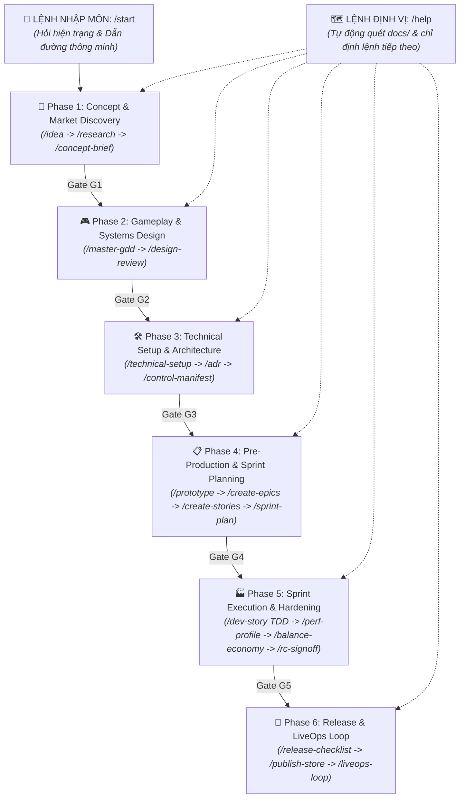

# 🎮 ASOL Game OS Ver 2.0 (Workflow Engine)
*Hệ Thống Quy Chuẩn Vận Hành & Bộ AI Skills Phát Triển Game Casual / Hybrid-Casual*
*Alpaca Solutions (ASOL) — Tối ưu hóa linh hoạt trên Phaser.js / Godot 4 / Unity 6*

---

## 🗺️ TỔNG QUAN HỆ THỐNG 6 PHASES (LIFECYCLE ARCHITECTURE)

Khác với mô hình cũ (10LC bị phân mảnh), ASOL Game OS v2 được tái cấu trúc hoàn chỉnh thành **6 Giai đoạn (6 Lifecycle Phases)** mạch lạc, điều hướng thông minh qua **`/start`** và **`/help`**:

---

## 🗂️ BẢN ĐỒ TIẾN ĐỘ XÂY DỰNG BỘ SKILLS V2 (100% HOÀN TẤT)

| File / Thư mục | Trạng thái | Lệnh kích hoạt | Trách nhiệm cốt lõi |
|---|:---:|---|---|
| **`USER-GUIDE.vi.md`** | ✅ HOÀN THÀNH | — | **Cẩm nang vận hành thủ công (Fallback Guide)**: Chi tiết cách tag từng agent, input/output qua 6 Phase cho Dev & Designer. |
| **`_shared-rules.vi.md`** | ✅ HOÀN THÀNH | — | **Hiến pháp vận hành chung (Global SSOT)**: 3 quy tắc vàng, Bảng ánh xạ Gate 2 tầng, chuẩn thư mục `docs/`. |
| **`workflow-catalog.yaml`** | ✅ HOÀN THÀNH | — | Bản đồ vệ tinh trung tâm quản lý 6 Phase và kiểm soát Artifacts. |
| **`00-start-agent.vi.md`** | ✅ HOÀN THÀNH | `/start` | Agent Onboarding: Hỏi hiện trạng, gợi ý phương án kèm `[Recommended]`. |
| **`00-help-agent.vi.md`** | ✅ HOÀN THÀNH | `/help` | Agent GPS: Quét thư mục `docs/` của dự án và chỉ định lệnh tiếp theo. |
| **`phase-01-concept-discovery/`** | ✅ HOÀN THÀNH | `/idea`, `/research`, `/concept-brief` | Sàng lọc ý tưởng casual, nghiên cứu đối thủ, chốt Game Brief 8 trường & Gate G1. |
| **`phase-02-gameplay-systems/`** | ✅ HOÀN THÀNH | `/master-gdd`, `/design-review` | Soạn thảo **Master GDD 5 chương hợp nhất duy nhất**, UX Flow, Ads/Save & Gate G2. |
| **`phase-03-technical-setup/`** | ✅ HOÀN THÀNH | `/technical-setup`, `/adr`, `/control-manifest` | Kiến trúc Đa Nền Tảng (**Phaser / Godot / Unity**), Kho **Gameplay Micro-Engines**, 3 ADRs & Gate G3. |
| **`phase-04-pre-production/`** | ✅ HOÀN THÀNH | `/prototype`, `/create-epics`, `/create-stories`, `/sprint-plan` | Lọc Scope Greybox kiểm chứng Fun Gate, bóc tách Epics & Stories 15-45p, Unit Test Runner & Gate G4. |
| **`phase-05-sprint-execution/`** | ✅ HOÀN THÀNH | `/dev-story`, `/perf-profile`, `/balance-economy`, `/rc-signoff` | Vòng lặp Sprint TDD, đồng bộ Live Dashboard, đo 60 FPS, cân bằng kinh tế, khóa bản RC & Gate G5. |
| **`phase-06-release-liveops/`** | ✅ HOÀN THÀNH | `/release-checklist`, `/publish-store`, `/hotfix`, `/liveops-loop` | Bộ 7 tiêu chuẩn xuất xưởng, ASO, Hotfix Day-1, LiveOps O-A-H-D-I-T-R-O & Đóng gói tri thức & Gate G6. |

---

## 💎 CÁC QUY TẮC VÀNG BẤT DI BẤT DỊCH (CORE GOVERNANCE RULES)

1. **Tài Liệu Luôn Nằm Tập Trung Trong `docs/` & Khởi Tạo Theo Nhu Cầu (On-Demand Docs Initialization)**: 100% tài liệu sinh ra từ `workflow-v2` (từ Idea Sheet, Master GDD, Kiến trúc/ADR, Epics/Stories, Task plan, Bảng theo dõi Sprint Task `sprint-status.md`, QA đến Release/LiveOps) bắt buộc đặt trực tiếp trong thư mục `docs/` của project người dùng (`docs/concept/`, `docs/gdd/`, `docs/architecture/`, `docs/prototype/`, `docs/plan/`, `docs/qa/`, `docs/release/`, `docs/liveops/`, `docs/retrospective/`). Khi chạy tự động hoặc thủ công từng skill, agent tự động kiểm tra và hỏi tạo thư mục con tương ứng nếu chưa có.
2. **Cổng Xác Nhận Trước Khi Tạo Thư Mục & Ghi File (User Confirmation Gate)**: AI tuyệt đối không tự ý tạo thư mục hay ghi file nếu chưa trình bày bản tóm tắt và được người dùng đồng ý. Có Safety Anchor ngay tại bước thao tác.
3. **Quy Tắc Đa Lựa Chọn & Khuyến Nghị (Ambiguity & Recommendation Rule)**: Khi gặp điểm chưa rõ hoặc cần ra quyết định, AI luôn đưa ra 2–4 lựa chọn cụ thể, đánh dấu **`[Recommended - Khuyến nghị]`** cho phương án tốt nhất kèm tùy chọn mở cho người dùng.
4. **Bảng Ánh Xạ Gate 2 Tầng**: Phân biệt giữa Trạng thái trừu tượng (`GO-STATE / HOLD-STATE / KILL-STATE`) và Nhãn hiển thị domain (`GO/HOLD/KILL` vs `PASS/CONDITIONAL PASS/FAIL`).
5. **Principle 09 — Earn Complexity**: Thiết kế tinh gọn tối đa cho dòng game Casual/Hybrid-Casual.
6. **Gameplay Micro-Engine Reusability**: Kho logic cơ chế tái sử dụng giúp giảm 70-80% thời gian code cho các game cùng thể loại.
7. **Gameplay Fun Gate**: Bắt buộc kiểm chứng Core Verb chơi có "cuốn" không qua bản Greybox 1-2 ngày trước khi sản xuất lớn.
8. **Strict Story Adherence & Live Dashboard**: Bám sát 100% Acceptance Criteria, cảnh báo lệch pha và tự động đồng bộ tiến độ vào `sprint-status.md`.
