# 📖 CẨM NANG HƯỚNG DẪN SỬ DỤNG THỦ CÔNG (MANUAL FALLBACK GUIDE)
*ASOL Game OS Ver 2.0 — Quy Trình Phối Hợp Người & AI Phát Triển Game Casual / Hybrid-Casual*
*Dành cho Lập trình viên & Game Designer (Đặc biệt hữu ích khi làm việc trên Cursor, Claude Code, Antigravity hoặc Web LLM)*

---

## 🧭 1. TỔNG QUAN & NGUYÊN TẮC VẬN HÀNH THỦ CÔNG

Khi hệ thống tự động hóa (các lệnh `/start`, `/help`) không khả dụng hoặc khi bạn muốn kiểm soát chi tiết từng tác vụ, bạn có thể **vận hành thủ công bằng cách tag trực tiếp file Agent (`@agent.vi.md`) kèm các file tài liệu đầu vào (`@input`)** trong cửa sổ chat với AI.

### 💡 Quy Tắc Vàng Khi Tag Thủ Công:
1. **Luôn tag kèm `_shared-rules.vi.md` (Hiến pháp vận hành):** Để AI luôn nhớ nguyên tắc hỏi trước khi tạo thư mục/ghi file và không tự ý sửa đổi code lung tung.
2. **Tuân thủ đúng hợp đồng Input ➔ Output:** Đầu ra (Artifact) của bước trước luôn là đầu vào bắt buộc của bước sau.
3. **Tuyệt đối không nhảy cóc Gate:** Mỗi phase đều kết thúc bằng một biên bản nghiệm thu (`*-signoff.md`). Chỉ khi biên bản đạt trạng thái `GO` hoặc `PASS` thì mới chuyển sang phase tiếp theo.
4. **Mọi tài liệu đều tập trung trong `docs/`:** 100% tài liệu từ Idea, GDD, ADR kiến trúc, Epics/Stories, Task plan, Bảng theo dõi Task `sprint-status.md`, QA đến Release/LiveOps đều phải nằm gọn trong cây thư mục `docs/`.
5. **Cơ chế Khởi tạo Thư mục Theo Nhu Cầu (On-Demand Docs Creation):** Khi bạn gọi thủ công bất kỳ skill nào (ví dụ `@01-master-gdd-agent.vi.md`, `@02-epic-decomposition-agent.vi.md`...), agent sẽ tự động kiểm tra xem thư mục `docs/[subfolder]/` tương ứng đã có chưa; nếu chưa, agent sẽ hỏi xác nhận bạn để tạo thư mục và ghi file vào đúng vị trí.

---

## 🗺️ 2. BẢN ĐỒ TỔNG HỢP LUỒNG DỮ LIỆU 6 PHASE (CHEAT SHEET)

```mermaid
flowchart TD
    subgraph P1["🚀 Phase 1: Concept Discovery"]
        P1_1["1.1: @01-idea-agent.vi.md<br><i>Output: docs/concept/idea-sheet.md</i>"] --> P1_2["1.2: @02-research-agent.vi.md<br><i>Output: docs/concept/research-pack.md</i>"]
        P1_2 --> P1_3["1.3: @03-concept-brief-agent.vi.md<br><i>Output: docs/concept/brief.md + g1-signoff</i>"]
    end

    subgraph P2["🎮 Phase 2: Gameplay Systems Design"]
        P2_1["2.1: @01-master-gdd-agent.vi.md<br><i>Output: docs/gdd/master-gdd.md</i>"] --> P2_2["2.2: @02-gdd-review-agent.vi.md<br><i>Output: docs/gdd/g2-validation-signoff.md</i>"]
    end

    subgraph P3["🛠️ Phase 3: Technical Setup & Architecture"]
        P3_1["3.1: @01-technical-setup-agent.vi.md<br><i>Output: docs/architecture/architecture.md</i>"] --> P3_2["3.2: @02-adr-agent.vi.md<br><i>Output: docs/architecture/decisions/ADR-*.md</i>"]
        P3_2 --> P3_3["3.3: @03-control-manifest-agent.vi.md<br><i>Output: docs/architecture/control-manifest.md + g3-signoff</i>"]
    end

    subgraph P4["📋 Phase 4: Pre-Production & Planning"]
        P4_1["4.1: @01-prototype-agent.vi.md<br><i>Output: docs/prototype/playtest-report.md (Fun Gate)</i>"] --> P4_2["4.2: @02-epic-decomposition-agent.vi.md<br><i>Output: docs/plan/overview.md</i>"]
        P4_2 --> P4_3["4.3: @03-story-planning-agent.vi.md<br><i>Output: docs/plan/stories/STORY-*.md</i>"]
        P4_3 --> P4_4["4.4: @04-sprint-setup-agent.vi.md<br><i>Output: docs/plan/sprints/sprint-01.md + g4-signoff</i>"]
    end

    subgraph P5["🏭 Phase 5: Sprint Execution & Hardening"]
        P5_1["5.1: @01-dev-story-agent.vi.md<br><i>Output: Source Code + docs/plan/sprints/sprint-status.md</i>"] --> P5_2["5.2: @02-perf-profile-agent.vi.md<br><i>Output: docs/qa/perf-profile-report.md</i>"]
        P5_2 --> P5_3["5.3: @03-balance-economy-agent.vi.md<br><i>Output: docs/qa/balance-report.md</i>"]
        P5_3 --> P5_4["5.4: @04-rc-signoff-agent.vi.md<br><i>Output: docs/qa/g5-rc-validation-signoff.md</i>"]
    end

    subgraph P6["🚀 Phase 6: Release & LiveOps Loop"]
        P6_1["6.1: @01-release-checklist-agent.vi.md<br><i>Output: docs/release/release-checklist.md + store-metadata.md</i>"] --> P6_2["6.2: @02-publish-store-agent.vi.md<br><i>Output: docs/release/patch-notes-v1.0.0.md + g6-signoff</i>"]
        P6_2 --> P6_3["6.3: @03-hotfix-patch-agent.vi.md (Khi có bug)<br><i>Output: docs/release/patch-notes-v1.0.1-hotfix.md</i>"]
        P6_2 --> P6_4["6.4: @04-liveops-retrospective-agent.vi.md<br><i>Output: docs/liveops/EXP-*.md + docs/retrospective/retrospective-report.md</i>"]
    end

    P1_3 -->|Gate G1 GO| P2_1
    P2_2 -->|Gate G2 PASS| P3_1
    P3_3 -->|Gate G3 PASS| P4_1
    P4_4 -->|Gate G4 PASS| P5_1
    P5_4 -->|Gate G5 PASS| P6_1
```



---

## 📚 3. HƯỚNG DẪN CHI TIẾT TỪNG BƯỚC QUA 6 GIAI ĐOẠN

---

### 🚀 GIAI ĐOẠN 1: CONCEPT & MARKET DISCOVERY

#### 🔸 Bước 1.1: Sàng lọc ý tưởng Game Casual
* **File Agent cần tag:** `@workflow-v2/phase-01-concept-discovery/01-idea-agent.vi.md`
* **File Quy tắc chung:** `@workflow-v2/_shared-rules.vi.md`
* **Đầu vào (Input):** Mô tả ý tưởng thô của bạn (thể loại, gameplay dự kiến, đối tượng người chơi).
* **💬 Câu Prompt mẫu:**
  ```markdown
  @01-idea-agent.vi.md @_shared-rules.vi.md
  Tôi có ý tưởng làm một con game casual giải đố ghép 3 kết hợp nuôi mèo. 
  Hãy giúp tôi sàng lọc ý tưởng này, đánh giá thang điểm 100 theo Idea Gate và lưu kết quả vào docs/concept/idea-sheet.md.
  ```
* **Đầu ra kỳ vọng (Output):** `docs/concept/idea-sheet.md` (Đạt $\ge 70$ điểm mới tiếp tục).

---

#### 🔸 Bước 1.2: Quét & Nghiên cứu đối thủ thị trường
* **File Agent cần tag:** `@workflow-v2/phase-01-concept-discovery/02-research-agent.vi.md`
* **Đầu vào (Input):** `@docs/concept/idea-sheet.md`
* **💬 Câu Prompt mẫu:**
  ```markdown
  @02-research-agent.vi.md @_shared-rules.vi.md @docs/concept/idea-sheet.md
  Dựa trên idea sheet đã có, hãy tiến hành phân tích 3 đối thủ trực tiếp hàng đầu trên Store, bóc tách Core Loop, cơ chế kiếm tiền và đề xuất điểm khác biệt (USP). Xuất kết quả vào docs/concept/research-pack.md.
  ```
* **Đầu ra kỳ vọng (Output):** `docs/concept/research-pack.md`.

---

#### 🔸 Bước 1.3: Chốt Game Concept Brief & Ký Gate G1
* **File Agent cần tag:** `@workflow-v2/phase-01-concept-discovery/03-concept-brief-agent.vi.md`
* **Đầu vào (Input):** `@docs/concept/research-pack.md`
* **💬 Câu Prompt mẫu:**
  ```markdown
  @03-concept-brief-agent.vi.md @_shared-rules.vi.md @docs/concept/research-pack.md
  Hãy tổng hợp lại toàn bộ nghiên cứu để soạn thảo Game Concept Brief chuẩn 8 trường thông tin và tiến hành đánh giá Gate G1 Signoff. Lưu tại docs/concept/brief.md và docs/concept/g1-validation-signoff.md.
  ```
* **Đầu ra kỳ vọng (Output):** 
  - `docs/concept/brief.md`
  - `docs/concept/g1-validation-signoff.md` (Phải đạt trạng thái `GO` mới sang Phase 2).

---

### 🎮 GIAI ĐOẠN 2: GAMEPLAY & SYSTEMS DESIGN

#### 🔸 Bước 2.1: Soạn thảo Master GDD 5 Chương Hợp Nhất
* **File Agent cần tag:** `@workflow-v2/phase-02-gameplay-systems/01-master-gdd-agent.vi.md`
* **Đầu vào (Input):** `@docs/concept/brief.md`
* **💬 Câu Prompt mẫu:**
  ```markdown
  @01-master-gdd-agent.vi.md @_shared-rules.vi.md @docs/concept/brief.md
  Dựa trên Concept Brief đã duyệt ở Gate G1, hãy soạn thảo bản Master GDD chuẩn 5 chương (Tổng quan, Core Loop & UX, Nội dung & Tính năng, Kinh tế & Quảng cáo, Kỹ thuật & Save Schema). Lưu vào docs/gdd/master-gdd.md.
  ```
* **Đầu ra kỳ vọng (Output):** `docs/gdd/master-gdd.md`.

---

#### 🔸 Bước 2.2: Đánh giá Thiết kế & Ký Gate G2
* **File Agent cần tag:** `@workflow-v2/phase-02-gameplay-systems/02-gdd-review-agent.vi.md`
* **Đầu vào (Input):** `@docs/gdd/master-gdd.md`
* **💬 Câu Prompt mẫu:**
  ```markdown
  @02-gdd-review-agent.vi.md @_shared-rules.vi.md @docs/gdd/master-gdd.md
  Hãy đóng vai Lead Game Designer rà soát tính khả thi của bản Master GDD này, kiểm tra UX flow và cơ chế giữ chân người chơi. Xuất biên bản thẩm định Gate G2 vào docs/gdd/g2-validation-signoff.md.
  ```
* **Đầu ra kỳ vọng (Output):** `docs/gdd/g2-validation-signoff.md` (Phải đạt `PASS` hoặc `CONDITIONAL PASS`).

---

### 🛠️ GIAI ĐOẠN 3: TECHNICAL SETUP & ARCHITECTURE

#### 🔸 Bước 3.1: Thiết lập Kiến trúc 4 Lớp & Performance Budget
* **File Agent cần tag:** `@workflow-v2/phase-03-technical-setup/01-technical-setup-agent.vi.md`
* **Đầu vào (Input):** `@docs/gdd/master-gdd.md` + Chọn nền tảng mục tiêu (ví dụ: Phaser.js, Godot 4, Unity 6).
* **💬 Câu Prompt mẫu:**
  ```markdown
  @01-technical-setup-agent.vi.md @_shared-rules.vi.md @docs/gdd/master-gdd.md
  Chúng tôi chọn làm game trên nền tảng [Phaser.js / Godot 4 / Unity 6]. Hãy thiết lập kiến trúc kỹ thuật phân tầng 4 lớp, ngân sách hiệu năng (60 FPS, RAM < 250MB, Draw Calls < 50) và lưu vào docs/architecture/architecture.md.
  ```
* **Đầu ra kỳ vọng (Output):** `docs/architecture/architecture.md`.
* 💡 **Mẹo:** Tham khảo thêm best practices trong `workflow-v2/phase-03-technical-setup/engines/[phaser|godot|unity]/`.

---

#### 🔸 Bước 3.2: Ghi nhận các Quyết định Kiến trúc (ADRs)
* **File Agent cần tag:** `@workflow-v2/phase-03-technical-setup/02-adr-agent.vi.md`
* **Đầu vào (Input):** `@docs/architecture/architecture.md`
* **💬 Câu Prompt mẫu:**
  ```markdown
  @02-adr-agent.vi.md @_shared-rules.vi.md @docs/architecture/architecture.md
  Hãy soạn thảo 3 biên bản quyết định kiến trúc quan trọng: ADR-001 (State Management), ADR-002 (Ads/Save Schema Isolation), ADR-003 (Asset & Object Pooling). Lưu vào thư mục docs/architecture/decisions/.
  ```
* **Đầu ra kỳ vọng (Output):** `docs/architecture/decisions/ADR-*.md`.

---

#### 🔸 Bước 3.3: Lập Hiến Pháp Coder 1 Trang (Control Manifest) & Ký Gate G3
* **File Agent cần tag:** `@workflow-v2/phase-03-technical-setup/03-control-manifest-agent.vi.md`
* **Đầu vào (Input):** `@docs/architecture/architecture.md`
* **💬 Câu Prompt mẫu:**
  ```markdown
  @03-control-manifest-agent.vi.md @_shared-rules.vi.md @docs/architecture/architecture.md
  Hãy đúc kết lại toàn bộ quy tắc kỹ thuật thành 1 trang Control Manifest duy nhất (danh sách cấm kỵ, quy ước đặt tên, các micro-engines tái sử dụng) và chốt biên bản Gate G3 tại docs/architecture/g3-validation-signoff.md.
  ```
* **Đầu ra kỳ vọng (Output):**
  - `docs/architecture/control-manifest.md`
  - `docs/architecture/g3-validation-signoff.md`.

---

### 📋 GIAI ĐOẠN 4: PRE-PRODUCTION & SPRINT PLANNING

#### 🔸 Bước 4.1: Kiểm chứng Gameplay Fun Gate qua Greybox Prototype
* **File Agent cần tag:** `@workflow-v2/phase-04-pre-production/01-prototype-agent.vi.md`
* **Đầu vào (Input):** `@docs/architecture/control-manifest.md` + Mã nguồn bản greybox đã dựng.
* **💬 Câu Prompt mẫu:**
  ```markdown
  @01-prototype-agent.vi.md @_shared-rules.vi.md @docs/architecture/control-manifest.md
  Chúng tôi đã hoàn thành bản Greybox Prototype kiểm tra Core Verb chơi trong 30 giây. Hãy đánh giá độ 'cuốn' (Juiciness, Input Responsiveness) và xuất báo cáo playtest vào docs/prototype/playtest-report.md.
  ```
* **Đầu ra kỳ vọng (Output):** `docs/prototype/playtest-report.md` (Fun Score $\ge 7/10$ mới tiến hành sản xuất lớn).

---

#### 🔸 Bước 4.2: Bóc tách 4 Epics Tổng Thể
* **File Agent cần tag:** `@workflow-v2/phase-04-pre-production/02-epic-decomposition-agent.vi.md`
* **Đầu vào (Input):** `@docs/gdd/master-gdd.md`
* **💬 Câu Prompt mẫu:**
  ```markdown
  @02-epic-decomposition-agent.vi.md @_shared-rules.vi.md @docs/gdd/master-gdd.md
  Hãy bóc tách toàn bộ dự án thành 4 Epics lớn: EPIC-01 (Core Gameplay), EPIC-02 (Meta & Progression), EPIC-03 (UI & Polish), EPIC-04 (Monetization & Release). Lưu vào docs/plan/overview.md.
  ```
* **Đầu ra kỳ vọng (Output):** `docs/plan/overview.md`.

---

#### 🔸 Bước 4.3: Phân rã Stories Chi Tiết (15–45 phút/story)
* **File Agent cần tag:** `@workflow-v2/phase-04-pre-production/03-story-planning-agent.vi.md`
* **Đầu vào (Input):** `@docs/plan/overview.md`
* **💬 Câu Prompt mẫu:**
  ```markdown
  @03-story-planning-agent.vi.md @_shared-rules.vi.md @docs/plan/overview.md
  Hãy phân rã các Epics thành các User Stories nhỏ có thời lượng thực thi 15–45 phút, đi kèm đầy đủ tiêu chí chấp nhận (Acceptance Criteria) và kịch bản Unit Test. Lưu vào thư mục docs/plan/stories/.
  ```
* **Đầu ra kỳ vọng (Output):** `docs/plan/stories/STORY-001.md`, `STORY-002.md`,...

---

#### 🔸 Bước 4.4: Lên Kế Hoạch Sprint 1 & Ký Gate G4
* **File Agent cần tag:** `@workflow-v2/phase-04-pre-production/04-sprint-setup-agent.vi.md`
* **Đầu vào (Input):** Thư mục `@docs/plan/stories/`
* **💬 Câu Prompt mẫu:**
  ```markdown
  @04-sprint-setup-agent.vi.md @_shared-rules.vi.md
  Hãy gom các stories ưu tiên cao vào kế hoạch Sprint 1, thiết lập lệnh chạy Unit Test Runner và chốt biên bản nghiệm thu Gate G4 tại docs/plan/g4-validation-signoff.md.
  ```
* **Đầu ra kỳ vọng (Output):**
  - `docs/plan/sprints/sprint-01.md`
  - `docs/plan/g4-validation-signoff.md`.

---

### 🏭 GIAI ĐOẠN 5: SPRINT EXECUTION & HARDENING

#### 🔸 Bước 5.1: Thực thi Code Story theo Chu Trình TDD
* **File Agent cần tag:** `@workflow-v2/phase-05-sprint-execution/01-dev-story-agent.vi.md`
* **Đầu vào (Input):** `@docs/plan/stories/STORY-xxx.md` + Mã nguồn hiện tại.
* **💬 Câu Prompt mẫu:**
  ```markdown
  @01-dev-story-agent.vi.md @_shared-rules.vi.md @docs/plan/stories/STORY-001.md
  Hãy đọc kỹ Acceptance Criteria của Story 001. Viết Unit Test trước (Red), sau đó viết code để pass test (Green), refactor và tự động cập nhật tiến độ vào docs/plan/sprints/sprint-status.md.
  ```
* **Đầu ra kỳ vọng (Output):** Mã nguồn tính năng + file cập nhật tiến độ `docs/plan/sprints/sprint-status.md`.

---

#### 🔸 Bước 5.2: Đo đạc & Tối ưu Hiệu năng (Profiling)
* **File Agent cần tag:** `@workflow-v2/phase-05-sprint-execution/02-perf-profile-agent.vi.md`
* **Đầu vào (Input):** `@docs/architecture/architecture.md` + Toàn bộ source code sau khi code xong tính năng.
* **💬 Câu Prompt mẫu:**
  ```markdown
  @02-perf-profile-agent.vi.md @_shared-rules.vi.md @docs/architecture/architecture.md
  Hãy kiểm tra mã nguồn đối chiếu với Performance Budget: 60 FPS, RAM < 250MB, Draw Calls < 50 và quét sạch các điểm tạo rác bộ nhớ (GC Spikes). Xuất báo cáo vào docs/qa/perf-profile-report.md.
  ```
* **Đầu ra kỳ vọng (Output):** `docs/qa/perf-profile-report.md`.

---

#### 🔸 Bước 5.3: Cân bằng Kinh tế & Thông số Gameplay
* **File Agent cần tag:** `@workflow-v2/phase-05-sprint-execution/03-balance-economy-agent.vi.md`
* **Đầu vào (Input):** `@docs/gdd/master-gdd.md` + File cấu hình bảng số liệu của game (JSON/CSV).
* **💬 Câu Prompt mẫu:**
  ```markdown
  @03-balance-economy-agent.vi.md @_shared-rules.vi.md @docs/gdd/master-gdd.md
  Hãy thẩm định đường cong độ khó (Difficulty Curve), tỉ lệ thưởng vàng và tính hợp lý của phễu kinh tế. Lưu báo cáo tại docs/qa/balance-report.md.
  ```
* **Đầu ra kỳ vọng (Output):** `docs/qa/balance-report.md`.

---

#### 🔸 Bước 5.4: Khóa Bản Build RC & Ký Gate G5
* **File Agent cần tag:** `@workflow-v2/phase-05-sprint-execution/04-rc-signoff-agent.vi.md`
* **Đầu vào (Input):** `@docs/qa/perf-profile-report.md` + `@docs/qa/balance-report.md`.
* **💬 Câu Prompt mẫu:**
  ```markdown
  @04-rc-signoff-agent.vi.md @_shared-rules.vi.md @docs/qa/perf-profile-report.md @docs/qa/balance-report.md
  Hãy kiểm tra các tiêu chí Smoke Test, tính toàn vẹn Save Data và callback Ads/IAP sandbox để khóa bản build Release Candidate (RC). Xuất biên bản Gate G5 tại docs/qa/g5-rc-validation-signoff.md.
  ```
* **Đầu ra kỳ vọng (Output):** `docs/qa/g5-rc-validation-signoff.md` (Bắt buộc `PASS` để chuyển sang Phase 6).

---

### 🚀 GIAI ĐOẠN 6: RELEASE & LIVEOPS LOOP

#### 🔸 Bước 6.1: Rà soát 7 Tiêu Chuẩn Xuất Xưởng & ASO
* **File Agent cần tag:** `@workflow-v2/phase-06-release-liveops/01-release-checklist-agent.vi.md`
* **Đầu vào (Input):** `@docs/qa/g5-rc-validation-signoff.md` + `@docs/concept/brief.md`.
* **💬 Câu Prompt mẫu:**
  ```markdown
  @01-release-checklist-agent.vi.md @_shared-rules.vi.md @docs/qa/g5-rc-validation-signoff.md @docs/concept/brief.md
  Hãy rà soát 7 tiêu chuẩn xuất xưởng bắt buộc và tạo bộ hồ sơ ASO (từ khóa, mô tả Store, ảnh chụp màn hình). Lưu vào docs/release/release-checklist.md và docs/release/store-metadata.md.
  ```
* **Đầu ra kỳ vọng (Output):**
  - `docs/release/release-checklist.md`
  - `docs/release/store-metadata.md`.

---

#### 🔸 Bước 6.2: Nghiệm Thu Phát Hành & Ký Gate G6
* **File Agent cần tag:** `@workflow-v2/phase-06-release-liveops/02-publish-store-agent.vi.md`
* **Đầu vào (Input):** `@docs/release/release-checklist.md` + File build xuất xưởng (.aab / .ipa / web .zip).
* **💬 Câu Prompt mẫu:**
  ```markdown
  @02-publish-store-agent.vi.md @_shared-rules.vi.md @docs/release/release-checklist.md
  Hãy kiểm tra chữ ký Release Keystore, soạn Patch Notes v1.0.0 và xuất biên bản nghiệm thu phát hành Gate G6 tại docs/release/g6-release-signoff.md.
  ```
* **Đầu ra kỳ vọng (Output):**
  - `docs/release/patch-notes-v1.0.0.md`
  - `docs/release/g6-release-signoff.md`.

---

#### 🔸 Bước 6.3: Vá Lỗi Khẩn Cấp Day-1 (Nếu có sự cố)
* **File Agent cần tag:** `@workflow-v2/phase-06-release-liveops/03-hotfix-patch-agent.vi.md`
* **Đầu vào (Input):** Crash Logs hoặc mô tả lỗi nhận được từ người chơi thật.
* **💬 Câu Prompt mẫu:**
  ```markdown
  @03-hotfix-patch-agent.vi.md @_shared-rules.vi.md
  Game phát sinh lỗi crash sau khi phát hành: [mô tả lỗi / dán crash log]. Hãy hướng dẫn vá lỗi cục bộ tối thiểu, đảm bảo không hỏng Save Data của người chơi cũ và soạn patch-notes-v1.0.1-hotfix.md.
  ```
* **Đầu ra kỳ vọng (Output):** `docs/release/patch-notes-v1.0.1-hotfix.md`.

---

#### 🔸 Bước 6.4: Thử Nghiệm LiveOps & Đóng Gói Tri Thức Studio
* **File Agent cần tag:** `@workflow-v2/phase-06-release-liveops/04-liveops-retrospective-agent.vi.md`
* **Đầu vào (Input):** Dữ liệu Analytics thực tế (D1/D7 retention, drop-off) + Toàn bộ hồ sơ trong `docs/`.
* **💬 Câu Prompt mẫu:**
  ```markdown
  @04-liveops-retrospective-agent.vi.md @_shared-rules.vi.md
  Dựa trên dữ liệu Analytics sau 7 ngày ra mắt, hãy thiết kế thử nghiệm A/B Test LiveOps để tối ưu retention, đồng thời tổng kết dự án và trích xuất các module tái sử dụng ngược về kho Studio OS. Lưu tại docs/liveops/EXP-001.md và docs/retrospective/retrospective-report.md.
  ```
* **Đầu ra kỳ vọng (Output):**
  - `docs/liveops/EXP-*.md`
  - `docs/retrospective/retrospective-report.md`.

---

## 🛠️ 4. TẬN DỤNG KHO GAMEPLAY MICRO-ENGINES CÓ SẴN

Trong Phase 3 và Phase 5, bạn không cần phải code lại các cơ chế casual phổ biến từ đầu. Hãy tận dụng các micro-engines có sẵn trong `workflow-v2/phase-03-technical-setup/gameplay-micro-engines/`:

1. **`grid-match-engine/`**: Bộ khung giải thuật xử lý lưới Match-3, tìm chuỗi nối và dồn ô (TypeScript độc lập nền tảng).
2. **`merge-drop-engine/`**: Cơ chế thả và hợp nhất vật phẩm (chuẩn game Suika / Merge 2).
3. **`score-combo-engine/`**: Hệ thống tính điểm nhân combo theo thời gian thực và quản lý high score.
4. **`level-progression-engine/`**: Quản lý mở khóa ải, tính số sao (1-3 sao) và lưu trữ cục bộ.

Khi code tính năng, bạn chỉ cần tag file logic tương ứng vào prompt để AI tích hợp trực tiếp vào engine của bạn:
```markdown
@grid-match-engine.ts @01-dev-story-agent.vi.md
Hãy tích hợp thuật toán kiểm tra ô ăn 3 từ grid-match-engine vào GameManager của dự án Phaser hiện tại.
```

---

## 🛑 5. BẢNG XỬ LÝ SỰ CỐ THƯỜNG GẶP (TROUBLESHOOTING)

| Tình huống | Nguyên nhân | Cách xử lý |
|---|---|---|
| **AI tự tiện tạo/sửa code mà chưa xin phép** | Quên không tag `_shared-rules.vi.md` | Dừng AI lại ngay, nhắc nhở tuân thủ *Core Invariant 1* trong `_shared-rules.vi.md`. |
| **AI tạo file lung tung ngoài thư mục gốc** | Không chỉ định đường dẫn `docs/` | Nhắc AI: *"Toàn bộ tài liệu phải đặt trong thư mục `docs/<phân-loại>/` theo đúng chuẩn SSOT"*. |
| **Bản build bị giật lag khi test** | Chưa chạy bước tối ưu ở Phase 5 | Tag `@02-perf-profile-agent.vi.md` để rà soát lại Draw Calls và GC Spikes. |
| **Gate bị đánh giá `HOLD` hoặc `KILL`** | Tiêu chí chưa đạt (thiếu AC, crash > 1%) | Đọc kỹ mục *Action Items* trong biên bản Gate, yêu cầu AI sửa triệt để các mục đó rồi chạy lại review agent. |
