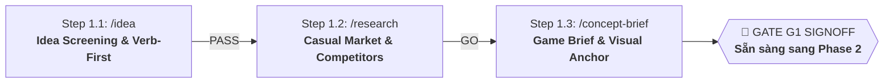

# 🚀 PHASE 1: CONCEPT & MARKET DISCOVERY
*Khám phá Ý tưởng, Nghiên cứu Thị trường & Định hình Khái niệm Game (Game Brief)*
*ASOL Game OS Ver 2.0 — Casual Studio Standard*

---

## 📌 1. TỔNG QUAN PHASE 1

Phase 1 là giai đoạn đầu tiên và quan trọng nhất trong vòng đời phát triển game tại ASOL. Mục tiêu của Phase 1 là **sàng lọc ý tưởng, kiểm chứng dữ liệu thị trường và khóa chặt bản Game Brief** trước khi tiêu tốn tài nguyên lập trình hay thiết kế chi tiết.



---

## 🗂️ 2. DANH MỤC CÁC AGENT TRONG PHASE 1

| Step | Lệnh gọi | Agent File | Trách nhiệm chính | Sản phẩm đầu ra (Artifacts) | Template đối ứng |
|:---:|---|---|---|---|---|
| **1.1** | `/idea` | `01-idea-agent.vi.md` | Tiếp nhận ý tưởng tự nhiên, bóc tách Core Verb & Light MDA, thách thức rủi ro. | • `docs/concept/idea-sheet.md`<br>• `docs/concept/idea-gate.md` | • `templates/idea-sheet-template.md`<br>• `templates/idea-gate-template.md` |
| **1.2** | `/research` | `02-research-agent.vi.md` | Quét 6 chiều RD1–RD6, phân tích 3 đối thủ trên Store, định hình Monetization (Ads/IAP). | • `docs/concept/research-pack.md`<br>• `docs/concept/market-validation-gate.md` | • `templates/research-pack-template.md`<br>• `templates/market-validation-gate-template.md` |
| **1.3** | `/concept-brief` | `03-concept-brief-agent.vi.md` | Chuẩn hóa Game Brief 8 trường, tư vấn Tech Stack (Phaser/Godot/Unity), chốt Visual Anchor, nghiệm thu Gate G1. | • `docs/concept/brief.md`<br>• `docs/concept/g1-validation-signoff.md` | • `templates/brief-template.md`<br>• `templates/g1-validation-signoff.md` |

---

## 📋 3. HỢP ĐỒNG BÀN GIAO SANG PHASE 2 (HAND-OFF CONTRACT)

Khi hoàn thành Phase 1, thư mục `docs/concept/` của dự án phải có đủ bộ tài liệu nguồn (SSOT):

1. **`docs/concept/idea-sheet.md`**: Ghi nhận ý tưởng gốc và Core Verb.
2. **`docs/concept/idea-gate.md`**: Biên bản Idea Gate đạt trạng thái **`PASS`**.
3. **`docs/concept/research-pack.md`**: Toàn bộ dữ liệu đối thủ và cơ chế kiếm tiền.
4. **`docs/concept/market-validation-gate.md`**: Biên bản Market Gate đạt trạng thái **`GO`**.
5. **`docs/concept/brief.md`**: [TÀI LIỆU QUAN TRỌNG NHẤT] Hồ sơ Game Brief chuẩn 8 trường.
6. **`docs/concept/g1-validation-signoff.md`**: Biên bản nghiệm thu chính thức Gate G1 đã đạt **`PASS`**.

---

## 📂 4. CẤU TRÚC THƯ MỤC NỘI BỘ

```
phase-01-concept-discovery/
├── 01-idea-agent.vi.md              # Đặc tả Agent Step 1.1 (/idea)
├── 02-research-agent.vi.md          # Đặc tả Agent Step 1.2 (/research)
├── 03-concept-brief-agent.vi.md     # Đặc tả Agent Step 1.3 (/concept-brief)
├── README.md                        # Tài liệu điều phối Phase 1
└── templates/                       # Bộ 5 template mẫu chuẩn mực 1-1
    ├── idea-sheet-template.md
    ├── idea-gate-template.md
    ├── research-pack-template.md
    ├── market-validation-gate-template.md
    ├── brief-template.md
    └── g1-validation-signoff.md
```
