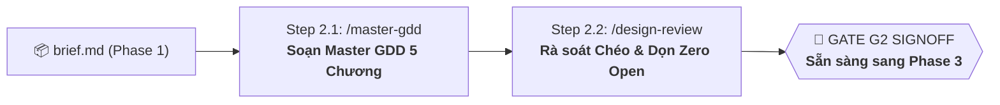

# 🎮 PHASE 2: GAMEPLAY & SYSTEMS DESIGN
*Thiết Kế Gameplay Hợp Nhất 5 Chương, Giao Diện UX & Kinh Tế Casual (Master GDD)*
*ASOL Game OS Ver 2.0 — Casual Studio Standard*

---

## 📌 1. TỔNG QUAN PHASE 2

Phase 2 là giai đoạn chuyển hóa bản Game Brief (`brief.md`) từ Phase 1 thành một hồ sơ thiết kế hoàn chỉnh, chi tiết và có tính thực thi cao.

Theo triết lý tinh gọn của ASOL Game OS v2, toàn bộ thiết kế game (từ luật chơi, giao diện màn hình, quy chuẩn mỹ thuật/âm thanh đến kinh tế và vị trí đặt quảng cáo) được **gộp vào DUY NHẤT một file `docs/gdd/master-gdd.md` gồm 5 chương chuẩn mực**, loại bỏ hoàn toàn tình trạng phân mảnh tài liệu.



---

## 🗂️ 2. DANH MỤC CÁC AGENT TRONG PHASE 2

| Step | Lệnh gọi | Agent File | Trách nhiệm chính | Sản phẩm đầu ra (Artifacts) | Template đối ứng |
|:---:|---|---|---|---|---|
| **2.1** | `/core-design`<br>hoặc `/master-gdd` | `01-master-gdd-agent.vi.md` | Tiếp nhận `brief.md`, hướng dẫn User viết trọn vẹn 5 chương của `master-gdd.md` theo 4 Design States. | • `docs/gdd/master-gdd.md` | • `templates/master-gdd-template.md` |
| **2.2** | `/design-review` | `02-gdd-review-agent.vi.md` | Quét mâu thuẫn chéo giữa Gameplay - UI - Kinh tế - Save Schema, dọn sạch trạng thái `OPEN`, chốt Gate G2. | • `docs/gdd/g2-validation-signoff.md` | • `templates/g2-validation-signoff.md` |

---

## 📋 3. HỢP ĐỒNG BÀN GIAO SANG PHASE 3 (HAND-OFF CONTRACT)

Khi hoàn thành Phase 2, thư mục `docs/gdd/` của dự án phải có đủ:

1. **`docs/gdd/master-gdd.md`**: [SINGLE SOURCE OF TRUTH] Toàn bộ thiết kế 5 chương hoàn chỉnh, 100% mục ở trạng thái **`DEFINED`**.
2. **`docs/gdd/g2-validation-signoff.md`**: Biên bản nghiệm thu Gate G2 đã đạt trạng thái **`PASS`**.

Tài liệu này là đầu vào trực tiếp cho **Phase 3: Technical Setup & Architecture** để Tech Lead lập hồ sơ kiến trúc, lựa chọn Playbook cho Engine (**Phaser / Godot / Unity**) và viết các quyết định kỹ thuật (ADRs).

---

## 📂 4. CẤU TRÚC THƯ MỤC NỘI BỘ

```
phase-02-gameplay-systems/
├── 01-master-gdd-agent.vi.md        # Đặc tả Agent soạn Master GDD 5 chương (/master-gdd)
├── 02-gdd-review-agent.vi.md        # Đặc tả Agent kiểm định & chốt Gate G2 (/design-review)
├── README.md                        # Tài liệu điều phối Phase 2
└── templates/                       # Bộ template chuẩn mực 1-1
    ├── master-gdd-template.md       # Mẫu Master GDD 5 chương hợp nhất
    └── g2-validation-signoff.md     # Mẫu biên bản nghiệm thu Gate G2
```
