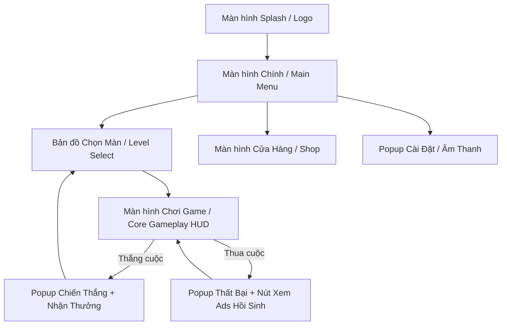

# [Tên Dự Án] — Master Game Design Document (GDD)
*Hồ sơ Thiết kế Game Hợp nhất Chuẩn 5 Chương — ASOL Game OS Ver 2.0*
*Ngày hoàn thiện: YYYY-MM-DD | Phiên bản: 1.0 | Engine: [Phaser.js / Godot 4 / Unity 6]*
*Trạng thái: [DRAFT / REVIEWING / APPROVED]*

---

## 📌 CHƯƠNG 1: GAMEPLAY & CƠ CHẾ CỐT LÕI (CORE GAMEPLAY & MECHANICS)

### 1.1. Khái niệm Cốt lõi & Động từ Hành động (Verb-First)
- **Primary Core Verb**: **[Động từ vật lý chính: *Tap / Swipe / Match-3 / Merge / Drag & Drop*]**
- **Secondary Verbs**: [*Upgrade / Collect / Unlock / Use Booster*]
- **Core Loop 3 Bước**:
  $$\text{[Thao tác Core Verb]} \longrightarrow \text{[Phản hồi thị giác/âm thanh tức thì]} \longrightarrow \text{[Nhận Thưởng/Tiến độ]}$$

### 1.2. Luật Chơi & Cơ Chế Chi Tiết (Game Rules & Mechanics)
- **Bàn chơi / Không gian chơi (Playfield)**: [Kích thước lưới grid (ví dụ: $8\times 8$), vị trí spawn nhân vật/chướng ngại vật]
- **Quy tắc tính điểm & Combo**: [Cách tính điểm, điều kiện kích hoạt combo x2, x3...]
- **Điều kiện Thắng (Win Conditions)**: [Đạt đủ số điểm mục tiêu, dọn sạch bàn cờ, sống sót qua N đợt quái...]
- **Điều kiện Thua / Thất bại (Fail States)**: [Hết thời gian (Time out), hết lượt đi (Moves out), bị chướng ngại vật chạm tới...]
- **Chướng ngại vật & Cơ chế cản trở (Obstacles)**: [Mô tả 2-3 loại chướng ngại vật: Băng đóng băng ô, Đá cản đường...]

### 1.3. Cảm giác Điều khiển & Hiệu ứng Phản hồi (Game Feel & Juice)
- **Feedback khi thao tác đúng**: [Hiệu ứng rung màn hình nhẹ (Haptics), hạt nổ lấp lánh (Particles), âm thanh "Pop/Ding" giòn tan]
- **Feedback khi thao tác sai / Cảnh báo**: [Lắc nhẹ ô (Shake), âm thanh cảnh báo ngắn]

---

## 🎨 CHƯƠNG 2: UX FLOW & GIAO DIỆN MÀN HÌNH (UX & SCREEN SPECS)

### 2.1. Sơ đồ Điều hướng Màn hình Tổng thể (Mermaid UI Flow)


### 2.2. Bố cục & Wireframe các Màn hình Chính (Mobile Thumb-Zone)
- **Gameplay HUD**:
  - *Khu vực đỉnh màn hình*: Hiển thị Level hiện tại, Điểm số, Nút Pause / Cài đặt.
  - *Khu vực trung tâm*: Không gian chơi chính (Playfield).
  - *Khu vực đáy màn hình*: 3 nút Booster hỗ trợ (thuận tiện cho ngón tay cái thao tác).
- **Win Popup**:
  - Hiển thị 3 ngôi sao đánh giá + Số tiền vàng kiếm được.
  - Nút chính (Nổi bật): "Xem Quảng cáo Nhận x2 Tiền".
  - Nút phụ: "Tiếp tục màn sau".
- **Lose Popup**:
  - Nút chính: "Xem Quảng cáo Hồi sinh (+3 Lượt đi / +15 Giây)".
  - Nút phụ: "Chơi lại từ đầu".

---

## 🖼️ CHƯƠNG 3: QUY CHUẨN MỸ THUẬT & ÂM THANH (VISUAL & AUDIO SPECS)

### 3.1. Bảng màu & Phong cách Mỹ thuật (Art Direction)
- **Phong cách đồ họa**: [2D Vector Cute / Flat Minimalist / 3D Low-poly Stylized]
- **Shape Language**: Bo tròn, thân thiện, không có góc cạnh sắc nhọn (Round, Soft).
- **Bảng màu chủ đạo (Hex Color Palette)**:
  - *Primary (Màu nhận diện)*: `#FF7F50` (Coral ấm áp)
  - *Secondary (Màu bổ trợ)*: `#FFD700` (Vàng kim rực rỡ cho tiền/sao)
  - *Background (Màu nền)*: `#FFF8DC` (Kem dịu mắt, không gây mỏi mắt)
  - *Success (Màu chiến thắng)*: `#32CD32` (Xanh lá tươi sáng)
  - *Warning/Fail (Màu cảnh báo)*: `#FF4500` (Cam đỏ)

### 3.2. Quy chuẩn Kích thước Tài nguyên (Asset Specs theo Engine)
- **Sprite UI / Icon**: Kích thước $128\times 128\text{ px}$ hoặc $256\times 256\text{ px}$ dạng PNG trong suốt.
- **Nhân vật / Chướng ngại vật**: Dạng Sprite Sheet (2D) hoặc Model Low-poly $<1000$ Tris (3D).
- **Từ khóa Prompt AI sinh Asset (Prompt References)**: `cute cozy game asset, flat vector icon, pastel colors, clean outline, white background`.

### 3.3. Danh mục Âm thanh (Audio Cues)
- **BGM (Nhạc nền)**: 1 Bài Lo-fi acoustic êm dịu, vòng lặp mượt mà (Loop 60-90s).
- **SFX (Âm thanh thao tác)**:
  - `sfx_tap`: Tiếng click nhẹ nhàng.
  - `sfx_match`: Tiếng "ting/pop" vui tai khi ghép thành công.
  - `sfx_win`: Tiếng chuông reo chiến thắng vui nhộn.
  - `sfx_lose`: Tiếng "wah-wah" nhẹ nhàng, không gây ức chế.

---

## ⚙️ CHƯƠNG 4: HỆ THỐNG CON, KINH TẾ & QUẢNG CÁO (SYSTEMS & ADS/IAP)

### 4.1. Tiến trình Màn chơi (Level Progression Curve)
- **Tổng số màn chơi MVP**: 30–50 màn.
- **Đường cong độ khó (Difficulty Curve)**:
  - *Màn 1–5 (Onboarding)*: Cực dễ, hướng dẫn luật chơi trong 30 giây, tỉ lệ thắng 100%.
  - *Màn 6–15 (Early Game)*: Giới thiệu chướng ngại vật đầu tiên, tỉ lệ thắng ~85%.
  - *Màn 16–30 (Mid Game)*: Thử thách kết hợp 2 chướng ngại vật, cần dùng Booster, tỉ lệ thắng ~65%.

### 4.2. Hệ thống Kinh tế & Tiền tệ (Economy & Currency)
- **Soft Currency (Tiền Vàng)**: Kiếm được qua mỗi màn chơi thắng (+50 đến +100 vàng). Dùng để mua Booster và trang trí.
- **Hard Currency (Kim Cương / Gems)** *(Tùy chọn)*: Nhận khi đạt mốc achievement hoặc mua bằng tiền thật (IAP).

### 4.3. Đặc tả Điểm Chạm Quảng cáo & IAP (Ads & Monetization Placements)
- **Rewarded Video Ads (Quảng cáo thưởng)**:
  - *Vị trí 1*: Hồi sinh thêm 3 lượt khi bị thua (Giới hạn: 1 lần/ván).
  - *Vị trí 2*: Nhân đôi số vàng nhận được ở màn hình Thắng (Win Popup).
  - *Vị trí 3*: Nhận miễn phí 1 Booster trong Shop mỗi 4 tiếng.
- **Interstitial Video Ads (Quảng cáo xen kẽ)**:
  - Hiển thị khi chuyển từ Win/Lose Popup về Main Menu.
  - *Quy tắc giãn cách (Cooldown)*: Tối thiểu 45 giây giữa 2 lần xuất hiện; không hiển thị ở 3 màn chơi đầu tiên.
- **Gói IAP (In-App Purchases)**:
  - `Gói Remove Ads` ($1.99): Tắt vĩnh viễn toàn bộ Interstitial Ads + Tặng 500 Vàng.

### 4.4. Cấu trúc Dữ liệu Lưu trữ (Save Data JSON Schema)
```json
{
  "profile": {
    "player_id": "player_001",
    "created_at": "2026-08-24T00:00:00Z"
  },
  "progression": {
    "current_level": 1,
    "highest_unlocked_level": 1,
    "stars_per_level": {
      "1": 3
    }
  },
  "economy": {
    "gold": 100,
    "gems": 0,
    "boosters": {
      "hammer": 2,
      "shuffle": 1
    }
  },
  "purchases": {
    "has_removed_ads": false
  },
  "settings": {
    "bgm_volume": 0.8,
    "sfx_volume": 1.0,
    "haptics_enabled": true
  }
}
```

---

## 📝 CHƯƠNG 5: NHẬT KÝ QUYẾT ĐỊNH & TRẠNG THÁI (DESIGN DECISION LOG)

### 5.1. Bảng Nhật Ký Quyết Định Thiết Kế (Design Decisions)

| Mã Quyết Định | Nội Dung Quyết Định | Lý Do / Căn Cứ | Trạng Thái |
|---|---|---|:---:|
| `GD-DEC-001` | Chốt Core Verb là **Swipe để ghép 3 ô cùng loại** | Phù hợp thao tác 1 tay trên mobile, dễ hiểu | **DEFINED** |
| `GD-DEC-002` | Áp dụng cơ chế Rewarded Ads hồi sinh thay vì bắt trả tiền | Tăng tỉ lệ giữ chân (Retention) cho game casual | **DEFINED** |
| `GD-DEC-003` | Cấu hình lưu Save Data offline bằng JSON mã hóa | Phù hợp tiêu chuẩn studio, chơi không cần mạng | **DEFINED** |

### 5.2. Đánh Giá Trạng Thái Hoàn Thiện (Zero Open States Check)
- [x] Không còn mục nào ở trạng thái **`OPEN`** (khoảng trống chưa quyết định).
- [x] Toàn bộ các đề xuất **`PROPOSED`** của AI đã được User/Lead duyệt và chuyển thành **`DEFINED`**.
- [x] Toàn bộ thông số kinh tế, UI flow và gameplay đã khớp 100% với nhau.
