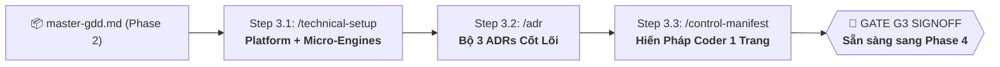

# 🛠️ PHASE 3: TECHNICAL SETUP & ARCHITECTURE
*Thiết Lập Kiến Trúc Đa Nền Tảng, Kho Gameplay Micro-Engines Tái Sử Dụng & Bản Hiến Pháp Lập Trình*
*ASOL Game OS Ver 2.0 — Casual Studio Standard (Phaser.js / Godot 4 / Unity 6)*

---

## 📌 1. TỔNG QUAN PHASE 3

Phase 3 là giai đoạn "xây móng kỹ thuật" vững chắc cho dự án. Mục tiêu của Phase 3 là:
1. **Chọn Platform Engine**: Kích hoạt bộ quy chuẩn công nghệ (**Phaser.js / Godot 4 / Unity 6**).
2. **Kế thừa Gameplay Micro-Engine**: Bốc các bộ máy logic thuần (**Grid-Match, Score-Combo, Level-Progression, Merge-Drop**) từ các game trước sang game mới để tái sử dụng ngay lập tức mà không phải code lại từ đầu.
3. **Khóa 3 ADRs Cốt lõi & Bản Hiến Pháp Coder 1 trang (`control-manifest.md`)**.



---

## 📚 2. HAI KHO TÀI SẢN KỸ THUẬT DÙNG CHUNG CỦA STUDIO

### 🌐 Nhánh 1: Platform Engines (`engines/`)
- 🌐 **`phaser/`**: Chuẩn TypeScript, Web Audio, LocalStorage Save, dung lượng $<5\text{MB}$.
- 🤖 **`godot/`**: Chuẩn GDScript 2.0 / C#, Signal Bus, Node FSM, Resource Save mã hóa.
- 🎮 **`unity/`**: Chuẩn Unity 6 C#, Addressables, MVP Pattern, Encrypted JSON Save.

### 🎮 Nhánh 2: Gameplay Micro-Engines (`gameplay-micro-engines/`)
- 🧩 **`grid-match-engine/`**: Logic bàn cờ, hoán đổi ô, tìm hàng Match-3, rơi gạch Cascade.
- 🏆 **`score-combo-engine/`**: Logic tính điểm, hệ số nhân Combo Multiplier, xếp hạng 1-3 sao.
- 🎯 **`level-progression-engine/`**: Struct màn chơi, đếm moves, kiểm tra Thắng/Thua.
- 🍒 **`merge-drop-engine/`**: Logic kéo thả hợp nhất 2 vật phẩm cùng cấp (2048/Suika style).

---

## 🗂️ 3. DANH MỤC CÁC AGENT TRONG PHASE 3

| Step | Lệnh gọi | Agent File | Trách nhiệm chính | Sản phẩm đầu ra (Artifacts) | Template đối ứng |
|:---:|---|---|---|---|---|
| **3.1** | `/technical-setup` | `01-technical-setup-agent.vi.md` | Đọc Brief & GDD $\rightarrow$ Ghép nối Platform Engine và Gameplay Micro-Engine $\rightarrow$ Xuất bản vẽ 4 tầng. | • `docs/architecture/architecture.md` | • `templates/architecture-template.md` |
| **3.2** | `/adr`<br>hoặc `/architecture-decisions` | `02-adr-agent.vi.md` | Soạn thảo 3 ADRs cốt lõi: State Management, Encrypted Save System, UI Decoupling. | • `docs/architecture/decisions/ADR-001...`<br>• `docs/architecture/decisions/ADR-002...`<br>• `docs/architecture/decisions/ADR-003...` | • `templates/adr-template.md` |
| **3.3** | `/control-manifest` | `03-control-manifest-agent.vi.md` | Đúc kết các quy tắc MUST DO và NEVER DO thành 1 trang phẳng, chốt Gate G3. | • `docs/architecture/control-manifest.md`<br>• `docs/architecture/g3-validation-signoff.md` | • `templates/control-manifest-template.md`<br>• `templates/g3-validation-signoff.md` |

---

## 📋 4. HỢP ĐỒNG BÀN GIAO SANG PHASE 4 (HAND-OFF CONTRACT)

Khi hoàn thành Phase 3, thư mục `docs/architecture/` của dự án phải có đủ:

1. **`docs/architecture/architecture.md`**: Bản thiết kế kiến trúc phân tầng 4 lớp.
2. **`docs/architecture/decisions/`**: Bộ 3 ADRs cốt lõi đều ở trạng thái **`ACCEPTED`**.
3. **`docs/architecture/control-manifest.md`**: [SINGLE SOURCE OF TRUTH] Bản Hiến pháp Coder 1 trang.
4. **`docs/architecture/g3-validation-signoff.md`**: Biên bản nghiệm thu Gate G3 đã đạt **`PASS`**.

Tài liệu này là đầu vào trực tiếp cho **Phase 4: Pre-Production & Sprint Planning** để kiểm chứng Fun Gate và bóc tách Epics / Stories.

---

## 📂 5. CẤU TRÚC THƯ MỤC NỘI BỘ

```
phase-03-technical-setup/
├── 01-technical-setup-agent.vi.md    # Đặc tả Agent thiết lập kiến trúc (/technical-setup)
├── 02-adr-agent.vi.md                # Đặc tả Agent soạn thảo ADRs (/adr)
├── 03-control-manifest-agent.vi.md   # Đặc tả Agent lập Hiến pháp Coder (/control-manifest)
├── README.md                         # Tài liệu điều phối Phase 3
├── engines/                          # Playbooks theo từng Engine (Phaser, Godot, Unity)
├── gameplay-micro-engines/           # Kho logic cơ chế game tái sử dụng
└── templates/                        # Bộ template chuẩn mực 1-1
    ├── architecture-template.md
    ├── adr-template.md
    ├── control-manifest-template.md
    └── g3-validation-signoff.md
```
