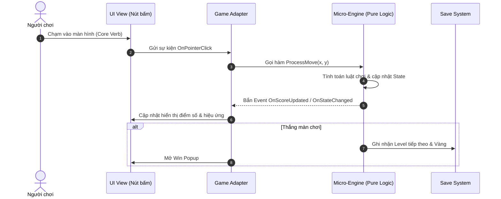

# [Tên Dự Án] — Master Technical Architecture Blueprint
*Hồ sơ Thiết Kế Kiến Trúc Phần Mềm — ASOL Game OS Ver 2.0*
*Ngày phê duyệt: YYYY-MM-DD | Engine: [Phaser.js / Godot 4 / Unity 6] | Trạng thái: APPROVED*

---

## 1. 🏗️ TỔNG QUAN HỆ THỐNG PHÂN TẦNG (SYSTEM LAYERS)

Dự án tuân thủ nghiêm ngặt mô hình kiến trúc phân tầng 4 lớp (từ dưới lên trên, cấm phụ thuộc ngược):

```
┌─────────────────────────────────────────────────────────────┐
│ 4. PRESENTATION / UI LAYER (Views, Prefabs, Canvas HUD)      │
└──────────────────────────────┬──────────────────────────────┘
                               │ (Lắng nghe sự kiện / Data-Binding)
┌──────────────────────────────▼──────────────────────────────┐
│ 3. ADAPTERS / CONTROLLER LAYER (MonoBehaviours / Scene Nodes)│
└──────────────────────────────┬──────────────────────────────┘
                               │ (Gọi hàm Pure Logic)
┌──────────────────────────────▼──────────────────────────────┐
│ 2. MICRO-ENGINES / DOMAIN CORE (Pure TS / GDScript / C#)    │
│    - FSM State Machine, Grid Evaluator, Score Calculator    │
└──────────────────────────────┬──────────────────────────────┘
                               │ (Sử dụng Service hạ tầng)
┌──────────────────────────────▼──────────────────────────────┐
│ 1. FOUNDATION SERVICES (Save Encrypted, Audio, Ads Bridge)  │
└─────────────────────────────────────────────────────────────┘
```

---

## 2. 🧩 DANH MỤC CÁC MÔ-ĐUN VÀ GIAO DIỆN (MODULE CONTRACTS)

### 2.1. Module Core Gameplay (Micro-Engine)
- **Trách nhiệm**: Xử lý toàn bộ logic bàn chơi, tính toán nước đi, kiểm tra thắng/thua.
- **Tính chất**: Hoàn toàn là Pure Code (không dính dáng đến Engine UI hay GameObject).
- **Giao tiếp**: Nhận input tọa độ $\rightarrow$ Trả về kết quả State mới và bắn Event.

### 2.2. Module Lưu Trữ (Save System)
- **Trách nhiệm**: Đọc/ghi dữ liệu người chơi theo schema đã định nghĩa ở `master-gdd.md`.
- **Cơ chế**: Mã hóa bảo mật, lưu trữ cục bộ (Offline-first).

### 2.3. Module Quảng Cáo & IAP (Monetization Service)
- **Trách nhiệm**: Làm cầu nối (Bridge/Wrapper) tới các mạng quảng cáo và hệ thống thanh toán Store.

---

## 3. 🔄 SƠ ĐỒ LUỒNG DỮ LIỆU CHÍNH (KEY DATA FLOW)



---

## 4. 🎯 QUY TẮC HIỆU NĂNG & GIỚI HẠN TÀI NGUYÊN (PERFORMANCE BUDGET)

- **Target FPS**: Ổn định $\ge 60\text{ FPS}$.
- **Max Memory (RAM)**: $< 250\text{MB}$.
- **Max Draw Calls**: $< 50$ (Mobile/Web).
- **Max Initial Package Size**: $< 50\text{MB}$ (Mobile) / $< 5\text{MB}$ (Web/Telegram).
