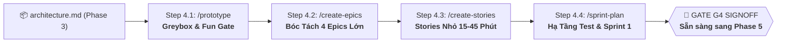

# 🕹️ PHASE 4: PRE-PRODUCTION & SPRINT PLANNING
*Kiểm Chứng Độ Vui (Fun Gate), Bóc Tách Epics/Stories 15-45 Phút & Khởi Động Sprint 1*
*ASOL Game OS Ver 2.0 — Casual Studio Standard*

---

## 📌 1. TỔNG QUAN PHASE 4

Phase 4 là giai đoạn chuyển tiếp quan trọng từ **Bản vẽ thiết kế** sang **Kế hoạch thực thi sản xuất chi tiết**.

Mục tiêu cốt lõi của Phase 4 là:
1. **Gameplay Fun Gate**: Dựng bản Greybox Prototype trong 1-2 ngày để kiểm chứng xem cơ chế chơi có thực sự "VUI & CUỐN" không trước khi đầu tư nhân lực sản xuất lớn.
2. **Agile 4-Tier Decomposition**: Bóc tách toàn bộ dự án thành 4 Epics lớn $\rightarrow$ User Stories bite-sized (15-45 phút/task) kèm tiêu chí kiểm thử rõ ràng.
3. **Sprint 1 Ready**: Thiết lập môi trường Unit Test tự động và lên danh sách Sprint 1 Backlog.



---

## 🗂️ 2. DANH MỤC CÁC AGENT TRONG PHASE 4

| Step | Lệnh gọi | Agent File | Trách nhiệm chính | Sản phẩm đầu ra (Artifacts) | Template đối ứng |
|:---:|---|---|---|---|---|
| **4.1** | `/prototype` | `01-prototype-agent.vi.md` | Hướng dẫn dựng Greybox, tổ chức Playtest nội bộ, đo Fun Factor, chốt cổng Fun Gate. | • `docs/prototype/playtest-report.md` | • `templates/playtest-report-template.md` |
| **4.2** | `/create-epics`<br>hoặc `/production-plan` | `02-epic-decomposition-agent.vi.md` | Bóc tách kiến trúc thành 4 Epics lớn theo 4 tầng, lập Dashboard tổng quan. | • `docs/plan/overview.md`<br>• `docs/plan/epics/EPIC-*.md` | • `templates/overview-template.md`<br>• `templates/epic-template.md` |
| **4.3** | `/create-stories` | `03-story-planning-agent.vi.md` | Bẻ nhỏ Epic thành các User Story 15-45 phút, khóa Files to touch và Acceptance Criteria. | • `docs/plan/stories/STORY-*.md` | • `templates/story-template.md` |
| **4.4** | `/test-setup`<br>hoặc `/sprint-plan` | `04-sprint-setup-agent.vi.md` | Cài đặt Runner Unit Test (Jest/GUT/UTF), lập kế hoạch Sprint 1, chốt Gate G4. | • `docs/plan/sprints/sprint-01.md`<br>• `docs/plan/g4-validation-signoff.md` | • `templates/sprint-plan-template.md`<br>• `templates/g4-validation-signoff.md` |

---

## 📋 3. HỢP ĐỒNG BÀN GIAO SANG PHASE 5 (HAND-OFF CONTRACT)

Khi hoàn thành Phase 4, thư mục `docs/plan/` phải có đủ:

1. **`docs/prototype/playtest-report.md`**: Báo cáo kiểm chứng độ vui ở trạng thái **`PASS`**.
2. **`docs/plan/overview.md`**: Dashboard tổng thể 4 Epics.
3. **`docs/plan/stories/STORY-*.md`**: Toàn bộ backlog ở trạng thái **`READY`** (đạt 100% DoR).
4. **`docs/plan/sprints/sprint-01.md`**: Danh sách task cụ thể cho Sprint 1.
5. **`docs/plan/g4-validation-signoff.md`**: Biên bản nghiệm thu Gate G4 đã đạt **`PASS`**.

Tài liệu này là đầu vào trực tiếp cho **Phase 5: Sprint Execution & Hardening** để bắt đầu code tính năng theo phương pháp TDD!

---

## 📂 4. CẤU TRÚC THƯ MỤC NỘI BỘ

```
phase-04-pre-production/
├── 01-prototype-agent.vi.md          # Đặc tả Agent kiểm chứng độ vui (/prototype)
├── 02-epic-decomposition-agent.vi.md # Đặc tả Agent bóc tách 4 Epics (/create-epics)
├── 03-story-planning-agent.vi.md     # Đặc tả Agent chia nhỏ Story 15-45p (/create-stories)
├── 04-sprint-setup-agent.vi.md       # Đặc tả Agent thiết lập Sprint 1 (/sprint-plan)
├── README.md                         # Tài liệu điều phối Phase 4
└── templates/                        # Bộ template chuẩn mực 1-1
    ├── playtest-report-template.md
    ├── overview-template.md
    ├── epic-template.md
    ├── story-template.md
    ├── sprint-plan-template.md
    └── g4-validation-signoff.md
```
