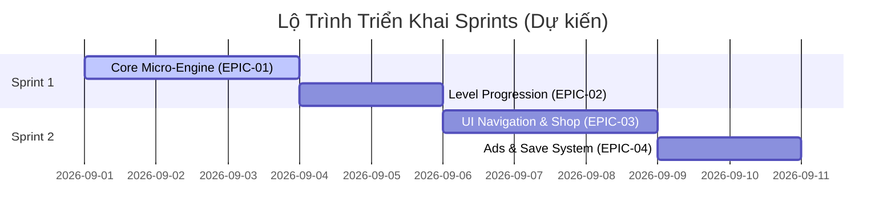

# [Tên Dự Án] — Production Plan & Dashboard Overview
*Kế Hoạch Sản Xuất Tổng Quan — ASOL Game OS Ver 2.0*
*Ngày cập nhật: YYYY-MM-DD | Tổng số Epics: [N] | Tổng số Stories: [M]*

---

## 1. 📊 TIẾN ĐỘ TỔNG QUAN THEO CÁC EPICS

| Mã Epic | Tên Epic | Số Stories | Ước lượng (Giờ) | Tiến độ (%) | Trạng thái |
|---|---|:---:|:---:|:---:|:---:|
| `EPIC-01` | Core Micro-Engine & Board Logic | 6 | 4.0h | 0% | READY |
| `EPIC-02` | Level Progression & Win/Lose | 5 | 3.5h | 0% | READY |
| `EPIC-03` | UI Navigation & Shop View | 8 | 5.0h | 0% | PLANNING |
| `EPIC-04` | Ads, IAP & Save System | 4 | 2.5h | 0% | PLANNING |

---

## 2. 🗺️ LỘ TRÌNH SPRINT (SPRINT ROADMAP)

---

## 3. 🎯 TIÊU CHÍ HOÀN THÀNH MVP (MVP TARGET DEFINITION)
- [ ] Chơi mượt mà qua 30 màn chơi.
- [ ] Tích hợp đầy đủ xem Rewarded Ads hồi sinh và banner/interstitial.
- [ ] Lưu trữ tiến độ người chơi an toàn khi tắt app mở lại.
- [ ] Đạt chuẩn 60 FPS trên thiết bị di động mục tiêu.
