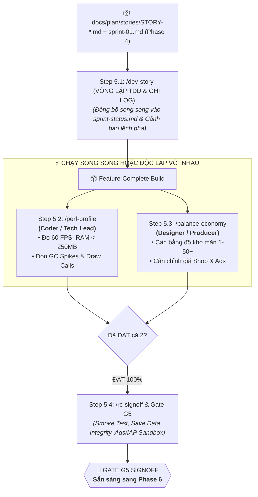

# 🏭 PHASE 5: SPRINT EXECUTION & HARDENING
*Vòng Lặp Lập Trình TDD, Giám Sát Kỷ Luật Story, Tối Ưu 60 FPS & Khóa Bản Build RC*
*ASOL Game OS Ver 2.0 — Casual Studio Standard*

---

## 📌 1. TỔNG QUAN PHASE 5

Phase 5 là giai đoạn sản xuất và hoàn thiện tính năng cốt lõi của dự án.

Mô hình vận hành của Phase 5 là **mô hình bán tuần tự (Hybrid)**:
1. **Bắt buộc tuần tự ở đầu (Step 5.1)**: Lập trình viên chạy vòng lặp TDD `/dev-story` để code xong toàn bộ danh sách Stories trong Sprint.
2. **Chạy song song ở giữa (Step 5.2 & Step 5.3)**:
   - Dev chạy `/perf-profile` để đo 60 FPS, dọn rác bộ nhớ.
   - Designer chạy `/balance-economy` để cân bằng 30-50 màn chơi và tỉ lệ xem Ads.
3. **Bắt buộc tuần tự ở cuối (Step 5.4)**: Chạy Smoke test, kiểm tra Save/Ads/IAP và ký duyệt bản build **Release Candidate (RC)**.



---

## 🗂️ 2. DANH MỤC CÁC AGENT TRONG PHASE 5

| Step | Lệnh gọi | Agent File | Trách nhiệm chính | Sản phẩm đầu ra (Artifacts) | Template đối ứng |
|:---:|---|---|---|---|---|
| **5.1** | `/dev-story`<br>hoặc `/story-done` | `01-dev-story-agent.vi.md` | Lập trình tính năng theo TDD, bám sát 100% AC, cảnh báo lệch pha, ghi Task Execution Log và tự động đồng bộ vào Live Dashboard. | • Mã nguồn + Unit Tests pass<br>• `docs/plan/sprints/sprint-status.md` (Live) | • `templates/sprint-status-template.md` |
| **5.2** | `/perf-profile` | `02-perf-profile-agent.vi.md` | Đo 60 FPS di động, quét rò rỉ RAM $<250\text{MB}$, tối ưu Draw Calls $<50$ và triệt tiêu GC Spikes. | • `docs/qa/perf-profile-report.md` | • `templates/perf-profile-report-template.md` |
| **5.3** | `/balance-economy`<br>hoặc `/balance-check` | `03-balance-economy-agent.vi.md` | Mô phỏng kinh tế vàng/gem, rà soát đường cong độ khó 30-50 màn chơi, kiểm tra giãn cách Ads. | • `docs/qa/balance-report.md` | • `templates/balance-report-template.md` |
| **5.4** | `/rc-signoff`<br>hoặc `/gate-check` | `04-rc-signoff-agent.vi.md` | Chạy Smoke test, kiểm tra tính toàn vẹn Save Data và Sandbox IAP/Ads, khóa bản build RC. | • `docs/qa/g5-rc-validation-signoff.md` | • `templates/g5-rc-validation-signoff.md` |

---

## 📋 3. HỢP ĐỒNG BÀN GIAO SANG PHASE 6 (HAND-OFF CONTRACT)

Khi hoàn thành Phase 5, thư mục `docs/qa/` phải có đủ:

1. **`docs/qa/perf-profile-report.md`**: Báo cáo hiệu năng đạt chuẩn 60 FPS (**PASS**).
2. **`docs/qa/balance-report.md`**: Báo cáo cân bằng kinh tế và màn chơi (**PASS**).
3. **`docs/qa/g5-rc-validation-signoff.md`**: [QUAN TRỌNG NHẤT] Biên bản nghiệm thu khóa chất lượng bản build **Release Candidate (RC)** đã đạt **`PASS`**.

Tài liệu này là đầu vào trực tiếp cho **Phase 6: Release & LiveOps** để chuẩn bị Store Metadata, từ khóa ASO và xuất bản lên các chợ ứng dụng / cổng Web!

---

## 📂 4. CẤU TRÚC THƯ MỤC NỘI BỘ

```
phase-05-sprint-execution/
├── 01-dev-story-agent.vi.md          # Đặc tả Agent lập trình TDD (/dev-story)
├── 02-perf-profile-agent.vi.md       # Đặc tả Agent đo hiệu năng 60 FPS (/perf-profile)
├── 03-balance-economy-agent.vi.md    # Đặc tả Agent cân bằng kinh tế (/balance-economy)
├── 04-rc-signoff-agent.vi.md         # Đặc tả Agent khóa bản build RC (/rc-signoff)
├── README.md                         # Tài liệu điều phối Phase 5
└── templates/                        # Bộ template chuẩn mực 1-1
    ├── sprint-status-template.md
    ├── perf-profile-report-template.md
    ├── balance-report-template.md
    └── g5-rc-validation-signoff.md
```
