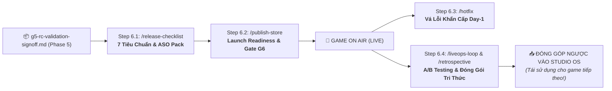

# 🚀 PHASE 6: RELEASE & LIVEOPS LOOP
*Bộ 7 Tiêu Chuẩn Xuất Bản Store/Web, ASO Keywords, Vòng Lặp LiveOps & Đóng Gói Tri Thức*
*ASOL Game OS Ver 2.0 — Casual Studio Standard*

---

## 📌 1. TỔNG QUAN PHASE 6

Phase 6 là giai đoạn đưa sản phẩm từ phòng lab ra thị trường thực tế và vận hành tăng trưởng dựa trên dữ liệu người chơi thật.

Mục tiêu cốt lõi của Phase 6 là:
1. **Store Release Validation**: Rà soát bộ 7 tiêu chuẩn xuất xưởng bắt buộc trước khi phát hành.
2. **ASO & Launch Pack**: Chuẩn bị đầy đủ hình ảnh, từ khóa tìm kiếm và siêu dữ liệu cho Store.
3. **Emergency Hotfix**: Sẵn sàng quy trình vá lỗi khẩn cấp trong ngày đầu mà không làm mất dữ liệu Save cũ của người dùng.
4. **Data-Driven LiveOps Loop (O-A-H-D-I-T-R-O)**: Vận hành thử nghiệm A/B Test để tăng chỉ số giữ chân (Retention) và doanh thu.
5. **Knowledge Harvesting**: Đóng gói các Gameplay Micro-Engines và bài học kinh nghiệm ngược trở lại kho thư viện ASOL để các dự án sau tái sử dụng.



---

## 🗂️ 2. DANH MỤC CÁC AGENT TRONG PHASE 6

| Step | Lệnh gọi | Agent File | Trách nhiệm chính | Sản phẩm đầu ra (Artifacts) | Template đối ứng |
|:---:|---|---|---|---|---|
| **6.1** | `/release-checklist` | `01-release-checklist-agent.vi.md` | Rà soát bộ 7 tiêu chuẩn xuất xưởng, tối ưu ASO Keywords và chuẩn bị Store Metadata. | • `docs/release/release-checklist.md`<br>• `docs/release/store-metadata.md` | • `templates/release-checklist-template.md`<br>• `templates/store-metadata-template.md` |
| **6.2** | `/publish-store`<br>hoặc `/launch-game` | `02-publish-store-agent.vi.md` | Kiểm tra chữ ký Release Key của file cài đặt, soạn Patch Notes v1.0.0, chốt Gate G6. | • `docs/release/patch-notes-v1.0.0.md`<br>• `docs/release/g6-release-signoff.md` | • `templates/patch-notes-template.md`<br>• `templates/g6-release-signoff.md` |
| **6.3** | `/hotfix`<br>hoặc `/day-one-patch` | `03-hotfix-patch-agent.vi.md` | Cô lập bug khẩn cấp, hướng dẫn vá lỗi tối thiểu bảo toàn 100% Save Data cũ. | • `docs/release/patch-notes-v1.0.1-hotfix.md` | • `templates/patch-notes-template.md` |
| **6.4** | `/liveops-loop`<br>hoặc `/retrospective` | `04-liveops-retrospective-agent.vi.md` | Vận hành chu trình A/B Testing O-A-H-D-I-T-R-O và đóng gói tài sản ngược về Studio OS. | • `docs/liveops/EXP-*.md`<br>• `docs/retrospective/retrospective-report.md` | • `templates/liveops-experiment-template.md`<br>• `templates/retrospective-template.md` |

---

## 📋 3. HỒ SƠ TỔNG KẾT DỰ ÁN (PROJECT COMPLETION PACK)

Khi Phase 6 hoàn tất, dự án sở hữu trọn vẹn:

1. **`docs/release/`**: Toàn bộ hồ sơ phát hành Store, từ khóa ASO và nhật ký bản vá.
2. **`docs/liveops/`**: Các báo cáo thử nghiệm A/B Test tăng trưởng Retention và Doanh thu.
3. **`docs/retrospective/`**: Báo cáo tổng kết dự án và danh mục các tài sản đã đóng góp ngược lại cho Studio OS.

Vòng đời của dự án chính thức khép lại trọn vẹn, mở ra kho tài nguyên kế thừa dồi dào cho con game tiếp theo của studio!

---

## 📂 4. CẤU TRÚC THƯ MỤC NỘI BỘ

```
phase-06-release-liveops/
├── 01-release-checklist-agent.vi.md       # Đặc tả Agent kiểm tra xuất xưởng & ASO (/release-checklist)
├── 02-publish-store-agent.vi.md           # Đặc tả Agent nghiệm thu phát hành (/publish-store)
├── 03-hotfix-patch-agent.vi.md            # Đặc tả Agent vá lỗi khẩn cấp (/hotfix)
├── 04-liveops-retrospective-agent.vi.md   # Đặc tả Agent LiveOps & Tổng kết (/liveops-loop)
├── README.md                              # Tài liệu điều phối Phase 6
└── templates/                             # Bộ template chuẩn mực 1-1
    ├── release-checklist-template.md
    ├── store-metadata-template.md
    ├── patch-notes-template.md
    ├── g6-release-signoff.md
    ├── liveops-experiment-template.md
    └── retrospective-template.md
```
