# Bộ khung tạo màn (level kit)

Tài liệu cho người tạo màn: hình nào dùng được, đặt mảnh thế nào, luật hiện/ẩn, quy trình từ nguồn tới `approved`, và ba màn mẫu để clone. Spec gốc: `docs/superpowers/specs/2026-10-02-b-level-kit-chapters-design.md` (B) và `2026-10-02-a-shapes-v2-design.md` (A).

## 1. Bảng hình

Mọi khung là hình vuông cạnh `s` (ô logic), tối đa 128. Ảnh minh hoạ là khung 48 giữa bàn, sinh bằng `npm run content:gallery` (dùng `renderPreviewSvg`, không sửa tay).

| Hình | `shapeKind` | Hướng | Khung cho phép | Minh hoạ |
|---|---|---|---|---|
| Vuông | `square` | 0 | bội của 8, ≥ 16 | 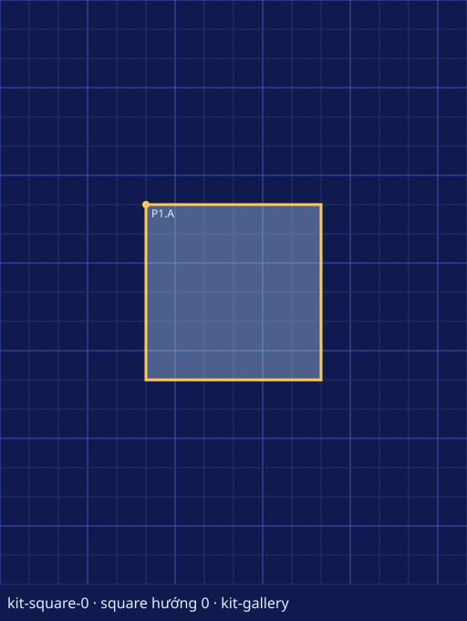 |
| Tam giác vuông cân, góc vuông ở TL/TR/BR/BL | `triangle` | 0–3 | bội của 8, ≥ 16 (tam giác nhỏ: 16 hoặc 24) | 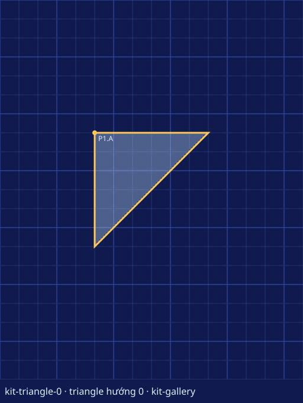 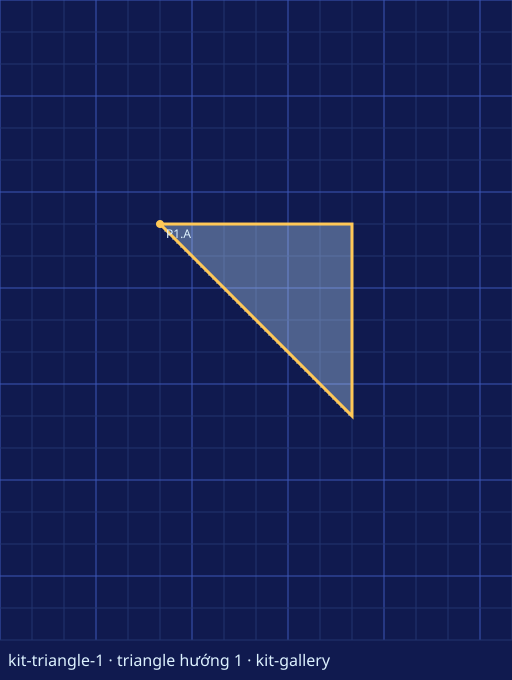 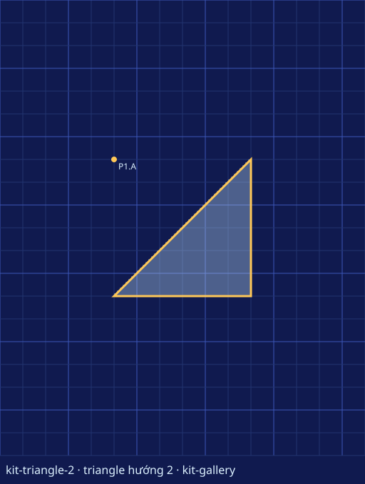 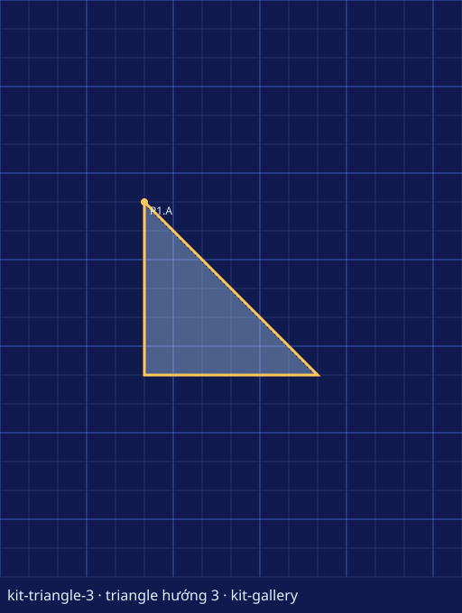 |
| Mái, cạnh huyền ở đáy/trái/đỉnh/phải, đỉnh mái ở tâm khung | `triangle` | 4–7 | bội của 16, ≥ 16 | 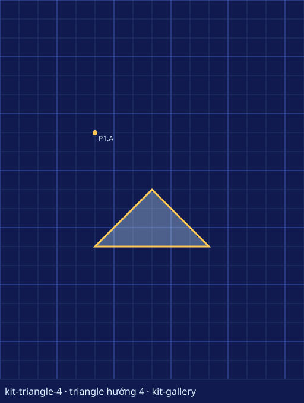 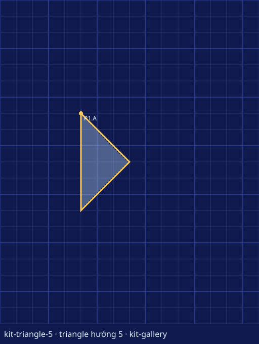 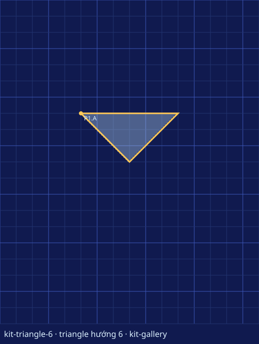 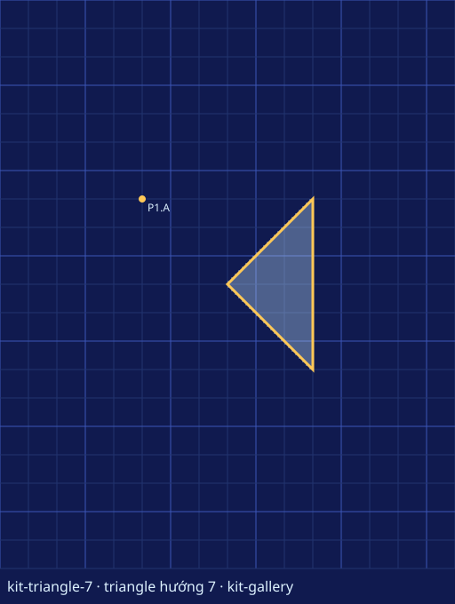 |
| Thoi | `diamond` | 0 | bội của 16, ≥ 16 | 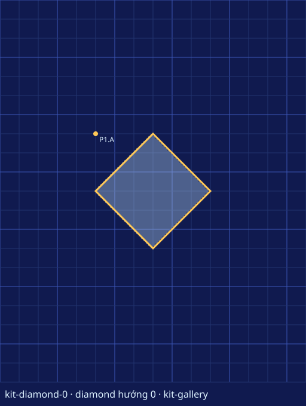 |
| Tròn (đa giác đều 32 cạnh) | `circle` | 0 | bội của 16, ≥ 16 | 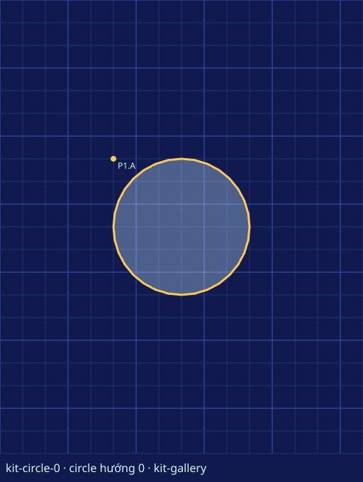 |
| Bình hành: 0 nằm nghiêng phải, 1 đứng, 2 nằm nghiêng trái, 3 đứng | `parallelogram` | 0–3 | bội của 48, ≥ 48 | 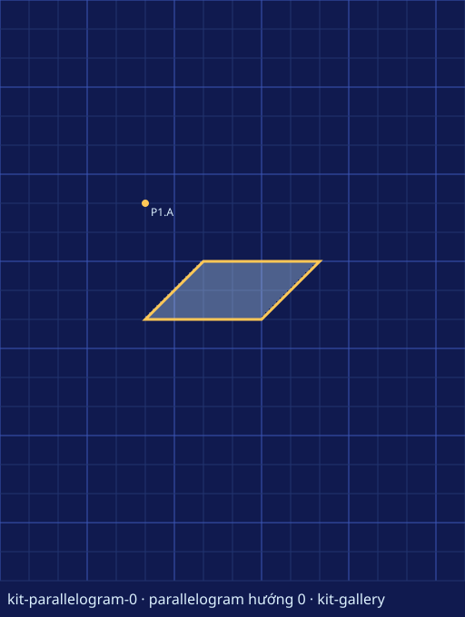 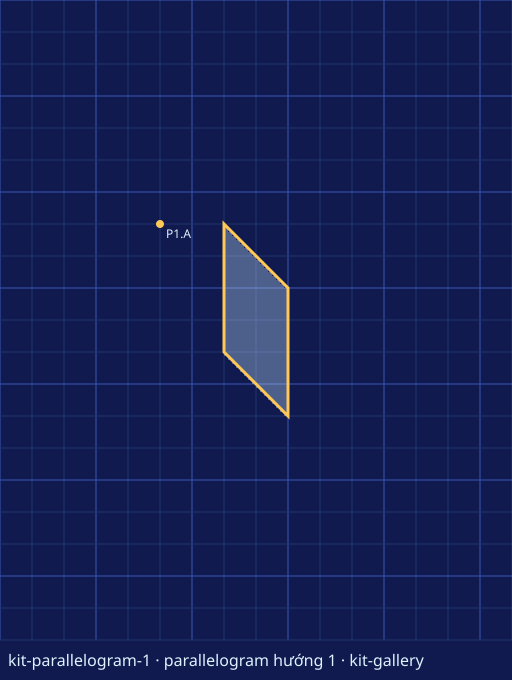 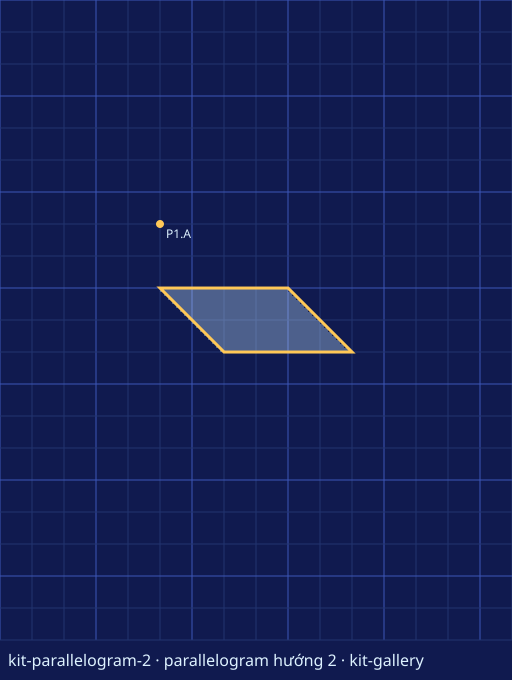 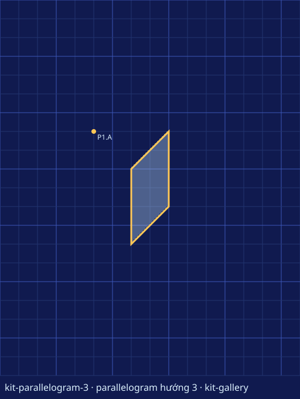 |

Lật gương (`mirrorX` qua trục dọc, `mirrorY` qua trục ngang) tự đổi hướng:

| Hình | `mirrorX` | `mirrorY` |
|---|---|---|
| Tam giác 0–3 | 0↔1, 2↔3 (TL↔TR, BL↔BR) | 0↔3, 1↔2 (TL↔BL, TR↔BR) |
| Mái 4–7 | 5↔7; 4 và 6 giữ nguyên | 4↔6; 5 và 7 giữ nguyên |
| Bình hành | 0↔2, 1↔3 | 0↔2, 1↔3 |
| Vuông, thoi, tròn | giữ 0 | giữ 0 |

## 2. Lưới và toạ độ

- Bàn logic 128 × 160 ô. **1 ô hiển thị = 8 ô logic**, **1 module = 24 ô logic** (vạch lưới đậm).
- Neo là **gốc khung** (góc trên-trái) và phải là bội của 8.
- Hàm ghép hình nhận **tâm khung**: `gốc = tâm − s/2`, `tâm = gốc + s/2`. Tâm bàn là `(64, 80)`.
- Ví dụ: vuông 48 tâm `(64, 80)` → gốc `(40, 56)`; tròn 96 tâm `(64, 80)` → gốc `(16, 32)`; thoi 16 tâm `(64, 80)` → gốc `(56, 72)`.
- Khung `s` có tâm trên lưới 8 khi `s/2` là bội của 8 (khung 16, 32, 48, 64, 96, 128). Khung 24 hay 40 thì tâm phải lệch 4: `piece` sẽ báo lỗi nếu gốc tính ra không phải bội của 8.

| Hàm (`src/content/kit.ts`) | Dùng khi |
|---|---|
| `piece(id, hình, khung, [cx, cy], { orientation, decoys })` | Đặt một mảnh theo tâm; neo A = vị trí đúng, neo nhiễu tên B–F theo thứ tự `decoys` |
| `mirrorX(p, x, newId)` / `mirrorY(p, y, newId)` | Mảnh đối xứng qua đường x = `x` / y = `y`; neo nhiễu lật theo |
| `concentric([cx, cy], specs)` | Nhiều mảnh chung tâm (mandala, sao, vầng sáng) |
| `row(prefix, hình, khung, [cx, cy], [dx, dy], n)` | Lặp mảnh đều nhau; id `<prefix>1..n` |
| `NUDGE` = `[[8,0],[-8,0],[0,8]]`, `CROSS` = `NUDGE` + `[0,-8]` | Bộ neo nhiễu sát dựng sẵn |

**Luật neo nhiễu KIT-03** (do `buildLevelDocument` áp dụng): neo nhiễu vượt biên bàn bị bỏ; neo nhiễu trùng neo A của một mảnh khác **cùng hình, cùng hướng, cùng khung** bị bỏ (hai mảnh giống hệt đổi chỗ sẽ sinh nghiệm thứ hai). Neo bị bỏ được liệt kê trong `docs/testing/levels/<id>-report.md`, mục "Neo nhiễu đã bỏ".

## 3. Luật chẵn lẻ

Mặt nạ dùng XOR: ô bị phủ **lẻ** lần thì hiện, **chẵn** lần thì ẩn. Mọi mảnh cùng màu.

| Số lớp phủ một ô | 0 | 1 | 2 | 3 | 4 | 5 |
|---|---|---|---|---|---|---|
| Trạng thái | ẩn | hiện | ẩn | hiện lại | ẩn | hiện |

Hệ quả khi thiết kế: chồng hai mảnh để khoét chỗ rỗng (mắt, cửa, khe); đặt mảnh thứ ba vào chỗ rỗng để nó hiện lại (ngọc, con ngươi). Chương 1 cấm chồng (`chapter-1-no-overlap`); xoay chỉ có ở Chương 4.

## 4. Quy trình tạo màn

1. `npm run content:new -- <id> --from <id-nguồn>` (hoặc không có `--from` để dùng `src/content/sources/_template.ts`; thêm `--title "<tên>"` nếu id chưa có trong manifest). Lệnh ghi `src/content/sources/<id>.ts`, đăng ký vào `sources/index.ts`, đổi `id`, `order`, `chapter`, tên hằng và `contentRevision` = `<slug>-v1`. Lệnh từ chối id đã có nguồn trong `sources/` hoặc `studio/`.
2. Sửa nguồn: mảnh bằng hàm ghép hình, `sampleSolutions`, `distractors`, mục tiêu học, FTUE, câu thơ.
3. `npm run content:author -- <id>`: sinh `src/content/levels/<id>.json`, `docs/testing/levels/<id>.svg` và `<id>-report.md`. Lệnh thất bại nếu có nghiệm dùng ít mảnh hơn.
4. Xem SVG, đọc báo cáo (số nghiệm phải là 1; mỗi gây nhiễu đổi bao nhiêu ô; neo nào bị KIT-03 bỏ). Chơi thử ở harness: `npm run dev` rồi mở `http://localhost:5173/?scene=play&level=<id>&mode=harness` (chỉ màn có trong manifest với `validated` trở lên).
5. Đăng ký vào `src/content/manifest.ts` và `src/content/catalog.ts` ở trạng thái `validated` (lệnh `content:new` không làm việc này).
6. Người review duyệt → đổi sang `approved` và tăng revision nếu sửa nguồn sau duyệt. Bản phát hành cần đủ 28 màn `approved` (`npm run content:validate -- --release`).

## 5. Ba màn mẫu để clone

### 1-2 Bảo Tháp Tiên Tri

Ghép cạnh: mái đặt khít trên đỉnh khối vuông, không chồng. Bản dưới cho đúng JSON của nguồn 1-2 hiện có.

```ts
import type { LevelSource } from '../authoring.ts'; // kiểu nguồn mô tả
import { piece } from '../kit.ts'; // hàm đặt mảnh theo tâm

export const baoThap: LevelSource = {
  id: '1-2', // mã màn, trùng tên file
  title: 'Bảo Tháp Tiên Tri', // tên hiển thị
  chapter: 1, // chương 1: ghép cạnh, cấm chồng
  order: 2, // thứ tự trong campaign
  contentRevision: 'bao-thap-v1', // slug không dấu + phiên bản
  rotationEnabled: false, // chương 1–3 không xoay
  pieces: [
    // Chân tháp: vuông 48, tâm (64, 88) → gốc (40, 64); neo nhiễu B lệch phải 8 ô
    piece('S1', 'square', 48, [64, 88], { decoys: [[8, 0]] }),
    // Mái hướng 4 (cạnh huyền ở đáy), tâm (64, 40) → gốc (40, 16); đáy mái y = 64 chạm đỉnh chân tháp
    piece('R1', 'triangle', 48, [64, 40], { orientation: 4, decoys: [[8, 0]] }),
  ],
  sampleSolutions: [
    [
      { pieceId: 'S1', anchorId: 'A', turns: 0 }, // chân tháp vào neo đúng
      { pieceId: 'R1', anchorId: 'A', turns: 0 }, // mái vào neo đúng
    ],
  ],
  learningObjective: 'Phối hợp hai hình khối khác nhau thành một biểu tượng', // màn dạy gì
  difficultyEstimate: 1, // 1–5
  distractors: [
    { pieceId: 'S1', anchorId: 'B', reason: 'Chân tháp lệch ngang' }, // gây nhiễu có chủ đích
    { pieceId: 'R1', anchorId: 'B', reason: 'Mái lệch khỏi trục tháp' },
  ],
  ftueSteps: [
    { id: 'combine-shapes', trigger: 'idle', end: 'drag-start', text: 'Mỗi mảnh một hình, ghép chúng thành bóng mục tiêu' }, // gợi ý khi ngồi yên
  ],
  victoryVerse: 'Tháp vươn lên trời, lời tiên tri có chỗ đứng.', // câu thơ khi thắng
};
```

### 2-3 Trái Tim Tinh Thể

Rỗng và hiện lại: hai cánh mái đâm qua nhau để lại tâm thoi rỗng (2 lớp), viên ngọc thoi 16 đặt vào đó hiện lại (3 lớp). Toạ độ theo spec C; nguồn thật do plan C viết.

```ts
import type { LevelSource } from '../authoring.ts'; // kiểu nguồn mô tả
import { NUDGE, mirrorX, piece } from '../kit.ts'; // đặt theo tâm, lật gương, neo nhiễu sát

// Cánh phải: mái 96 hướng 5, tâm (80, 80) → gốc (32, 32). Không có neo lệch phải (sẽ vượt biên).
const wing = piece('T1', 'triangle', 96, [80, 80], { orientation: 5, decoys: [[-8, 0], [0, 8], [0, -8]] });

export const traiTimTinhThe: LevelSource = {
  id: '2-3', // mã màn
  title: 'Trái Tim Tinh Thể', // tên hiển thị
  chapter: 2, // chương 2: chồng lớp chẵn lẻ
  order: 9, // thứ tự trong campaign
  contentRevision: 'trai-tim-tinh-the-v1', // slug + phiên bản
  rotationEnabled: false, // không xoay
  pieces: [
    wing, // cánh phải, neo nhiễu B (24,32), C (32,40), D (32,24)
    mirrorX(wing, 64, 'T2'), // cánh trái qua trục x = 64: hướng 7, gốc (0, 32), neo nhiễu B (8,32), C (0,40), D (0,24)
    piece('C1', 'diamond', 16, [64, 80], { decoys: NUDGE }), // ngọc thoi 16 ở tâm rỗng, gốc (56, 72)
  ],
  sampleSolutions: [
    [
      { pieceId: 'T1', anchorId: 'A', turns: 0 }, // cánh phải
      { pieceId: 'T2', anchorId: 'A', turns: 0 }, // cánh trái: vùng giao 2 lớp → rỗng
      { pieceId: 'C1', anchorId: 'A', turns: 0 }, // ngọc: 3 lớp → hiện lại
    ],
  ],
  learningObjective: 'Dự đoán được ba lớp thì vùng đó hiện lại', // màn dạy gì
  difficultyEstimate: 3, // 1–5
  distractors: [
    { pieceId: 'T1', anchorId: 'B', reason: 'Lệch trái 8 ô' }, // cánh ăn sâu quá
    { pieceId: 'T2', anchorId: 'B', reason: 'Lệch phải 8 ô' },
    { pieceId: 'C1', anchorId: 'B', reason: 'Lệch phải 8 ô' }, // ngọc lệch khỏi tâm rỗng
  ],
  ftueSteps: [
    { id: 'third-layer', trigger: 'two-layers', end: 'three-layers', text: 'Thêm mảnh thứ ba: vùng đó hiện lại' }, // gợi ý sau khi có vùng 2 lớp
  ],
  victoryVerse: 'Trong khoảng rỗng, một trái tim tinh thể bừng sáng.', // câu thơ khi thắng
};
```

### 3-10 Mandala Thiên Cầu

Mandala chung tâm: năm tầng chẵn lẻ xen kẽ (đĩa tròn, vuông rỗng, thoi sáng, tâm tròn rỗng, ngọc thoi sáng). Toạ độ theo spec C; nguồn thật do plan C viết.

```ts
import type { LevelSource } from '../authoring.ts'; // kiểu nguồn mô tả
import { NUDGE, concentric } from '../kit.ts'; // nhiều mảnh chung tâm, neo nhiễu sát

export const mandalaThienCau: LevelSource = {
  id: '3-10', // mã màn
  title: 'Mandala Thiên Cầu', // tên hiển thị
  chapter: 3, // chương 3: Họa Phẩm
  order: 22, // màn cuối Họa Phẩm
  contentRevision: 'mandala-thien-cau-v1', // slug + phiên bản
  rotationEnabled: false, // không xoay
  // Năm mảnh chung tâm bàn (64, 80); gốc khung = tâm − khung/2
  pieces: concentric([64, 80], [
    { id: 'C1', kind: 'circle', size: 96, decoys: NUDGE }, // đĩa ngoài, gốc (16, 32): 1 lớp → hiện
    { id: 'S1', kind: 'square', size: 64, decoys: NUDGE }, // vuông, gốc (32, 48): 2 lớp → rỗng
    { id: 'D1', kind: 'diamond', size: 64, decoys: NUDGE }, // thoi, gốc (32, 48): 3 lớp → hiện lại
    { id: 'C2', kind: 'circle', size: 32, decoys: NUDGE }, // tâm tròn, gốc (48, 64): 4 lớp → rỗng
    { id: 'K1', kind: 'diamond', size: 16, decoys: NUDGE }, // ngọc, gốc (56, 72): 5 lớp → hiện
  ]),
  sampleSolutions: [
    [
      { pieceId: 'C1', anchorId: 'A', turns: 0 }, // mỗi mảnh vào neo A
      { pieceId: 'S1', anchorId: 'A', turns: 0 },
      { pieceId: 'D1', anchorId: 'A', turns: 0 },
      { pieceId: 'C2', anchorId: 'A', turns: 0 },
      { pieceId: 'K1', anchorId: 'A', turns: 0 },
    ],
  ],
  learningObjective: 'Tổng hợp: năm tầng chẵn lẻ xen kẽ', // màn dạy gì
  difficultyEstimate: 5, // màn khó nhất chương
  distractors: [
    { pieceId: 'S1', anchorId: 'B', reason: 'Lệch phải 8 ô' }, // một tầng lệch là cả vòng rỗng lệch
    { pieceId: 'K1', anchorId: 'C', reason: 'Lệch trái 8 ô' },
  ],
  ftueSteps: [], // không cần hướng dẫn
  victoryVerse: 'Thiên cầu xoay quanh một viên ngọc, bức họa hoàn tất.', // câu thơ khi thắng
};
```

## 6. Mẹo tăng độ khó

- **Neo nhiễu gần:** dùng `NUDGE` hoặc `CROSS` thay cho một neo lệch xa; mảnh lệch 8 ô chỉ đổi vài trăm ô nên khó nhận ra. Xem cột "Số ô đổi" trong báo cáo: số càng nhỏ, gây nhiễu càng tinh.
- **Giấu cạnh mảnh vào vùng rỗng:** cho cạnh một mảnh nằm trong vùng 2 lớp của hai mảnh khác, người chơi không thấy đường viền để căn.
- **Nhiều mảnh giống nhau:** đặt hai mảnh cùng hình, cùng khung ở hai chỗ; KIT-03 tự bỏ neo nhiễu trùng chỗ để nghiệm vẫn duy nhất.
- **Đối xứng giả:** dùng `mirrorX` cho hình tổng thể nhưng cho một bên neo nhiễu khác bên kia.
- **Chế độ đặt tự do** (spec D, khi có): mảnh hít vào mọi giao điểm lưới thay vì vài neo, nên không còn gợi ý vị trí.
