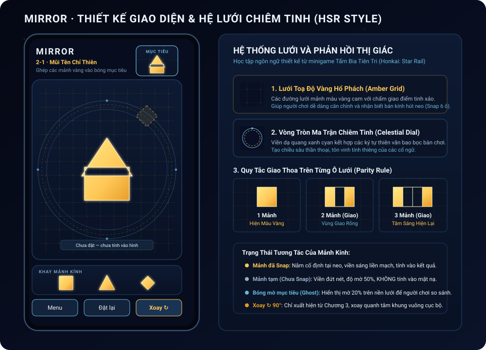
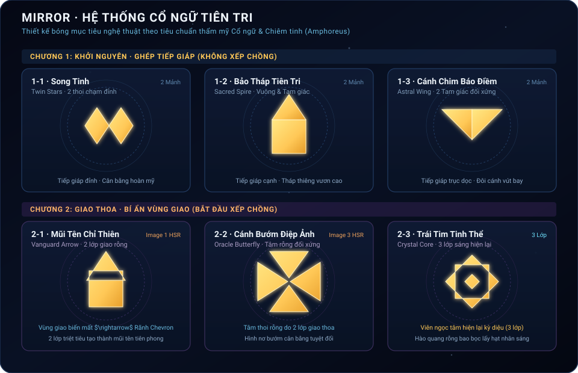

# Mirror — Master Game Design Document

*Bản thiết kế trải nghiệm cho Android MVP · 30/09/2026 · phiên bản 0.2.1*

## Tổng quan trong 30 giây

> **High concept:** Mirror là game giải đố ghép bóng hình (*silhouette overlap puzzle*) trên điện thoại: kéo các mảnh kính cùng màu vào bàn để tạo đúng bóng mục tiêu; hai mảnh chồng nhau làm vùng giao biến mất, mảnh thứ ba làm vùng đó hiện lại.

| Câu hỏi | Câu trả lời thiết kế |
|---|---|
| Dành cho ai? | Người thích puzzle quan sát, thử nghiệm bằng tay, chơi thư giãn mà không có đồng hồ hay giới hạn lượt. Độ tuổi và thói quen chơi cần xác nhận bằng playtest. |
| Người chơi làm gì? | Xem bóng mục tiêu, kéo mảnh từ khay vào bàn, thử các vị trí neo, quan sát vùng hiện/trống, rồi từ Chương 3 xoay mảnh từng nấc 90°. |
| Điểm khác biệt | Người chơi **tạo khoảng trống có chủ đích** bằng giao nhau, thay vì chỉ lấp đầy một khuôn; vùng giao của mảnh cùng màu có thể biến mất rồi hiện lại. |
| Một phiên chơi | Mục tiêu thiết kế **2–5 phút** cho 1–3 màn đầu; đây là giả thuyết để đo, chưa phải kết quả thực tế. Có thể thoát về menu giữa hai màn. |
| Quy mô MVP | 18 màn thủ công dự kiến, ba chương × sáu màn; Android dọc, offline, miễn phí, một màu mảnh, không quảng cáo/IAP. |
| Tham chiếu | [Shadowmatic](https://www.shadowmatic.com/) cho cảm giác khám phá bóng hình; [Gorogoa](https://new.annapurnainteractive.com/en/games/gorogoa) cho cách người chơi thử thao tác hình ảnh. Đây là tham chiếu trải nghiệm, không phải mẫu sao chép cơ chế. |

**Định vị:** dùng “puzzle ghép bóng bằng vùng giao” trong mô tả sản phẩm; tránh gọi là “match hình” vì dễ bị hiểu thành match-3 hoặc ghép cặp. Không dùng hình minh họa nhiều màu trong tài liệu MVP: giao nhau giữa **khác màu** chỉ thuộc giai đoạn sau, khi đó mới quyết định pha màu hay hiện màu mảnh trên cùng.

**Trạng thái duy nhất của tài liệu:** Đây là thiết kế để review, chưa phải xác nhận Gate G2. Sáu màn 1-1 đến 1-3 và 2-1 đến 2-3 có dữ liệu hình học từ prototype, nhưng nhịp học và độ khó chưa được playtest đủ. Mười hai màn còn lại mới có vai trò học và dữ liệu nháp trong cây làm việc, chưa được duyệt thành nội dung campaign. Các con số mang nhãn **mục tiêu/đề xuất** cần đo trên máy thật trước khi chốt. Nội dung thiết kế cần để hiểu Mirror được trình bày ngay trong file này; tài liệu nguồn ở cuối chỉ phục vụ truy vết.

---

## Chương 1 — Gameplay và luật

### 1.1. Trụ cột và vòng chơi

1. **Thử bằng tay, hiểu bằng mắt:** thao tác làm thay đổi hình ngay, nhất là vùng vừa biến mất hoặc hiện lại.
2. **Giải bóng kết quả:** mọi cách xếp tạo cùng silhouette đều hợp lệ; thứ tự đặt mảnh không phải điều kiện thắng.
3. **Sai sửa được:** kéo lại, trả khay hoặc đặt lại, không mất màn đã hoàn thành.

Vòng chơi: xem bóng mục tiêu → kéo/thả hoặc xoay → so vùng hiện/trống → điều chỉnh → silhouette trùng hoàn toàn → mở màn tiếp. Không có thời gian, điểm, sao, giới hạn lượt hay phạt đặt sai.

### 1.2. “Vùng” và quy luật giao

Bàn logic là lưới **128 × 192 ô**. Mỗi mảnh là tập các ô nằm trong khung vuông kích thước xác định; nét vẽ có thể mượt hơn nhưng phép chấm dùng ô lưới. Với một ô bất kỳ, đếm các **mảnh đã snap cùng màu** phủ ô đó: 0 mảnh = trống; 1 = hiện; 2 = trống; 3 = hiện. Nếu sau này có 4 mảnh cùng màu, ô lại trống. Chỉ vùng giao bị đổi trạng thái; phần còn lại của mảnh vẫn hiện. Mọi mảnh MVP có cùng một màu vàng cam. Vùng giao khác màu chưa có luật trong MVP và không xuất hiện trong 18 màn.

**Thắng:** so từng ô của mặt nạ kết quả với mặt nạ mục tiêu. Mọi ô phải khớp trạng thái hiện/trống, không thiếu hoặc thừa. Không bắt buộc dùng một danh sách neo đúng duy nhất. Mảnh đang ở khay hoặc ở vị trí tạm chưa snap không tham gia mặt nạ. Trật tự đặt mảnh không đổi kết quả của MVP một màu.

### 1.3. Kéo, neo và snap

- Mỗi mảnh có danh sách neo do tác giả màn đặt. Neo là **tọa độ gốc góc trên trái của khung mảnh** trên lưới, không phải tâm chạm ngón tay. Khi kéo, game giữ độ lệch giữa ngón tay và gốc mảnh.
- Giá trị đang dùng trong prototype: thả trong bán kính Euclid **6 ô lưới** tính từ gốc mảnh đến một neo của chính mảnh đó thì snap. Với bố cục logic 4 px/ô, bán kính này là 24 đơn vị canvas; đây là giá trị cần kiểm tra cảm giác chạm trên thiết bị, chưa chốt là tối ưu. Nếu nhiều neo cùng trong bán kính, chọn neo gần nhất; nếu bằng khoảng cách, ưu tiên neo đứng trước trong dữ liệu màn để kết quả ổn định.
- **Hai mảnh có thể cùng tọa độ neo** nếu dữ liệu của từng mảnh cho phép. Không đẩy mảnh trước ra ngoài. Cả hai cùng được tính trong vùng giao. “Neo đã có người” không phải lỗi.
- Mảnh snap nằm chắc tại neo và có xung viền ngắn. Neo không hiển thị sẵn như một đáp án; khi kéo gần, có thể hiện dấu hút nhẹ để người chơi biết vùng đặt hợp lệ.
- Thả xa mọi neo: mảnh được giữ tại vị trí tạm bằng **viền đứt, độ mờ khác biệt và nhãn ngắn “Chưa đặt — chưa tính vào hình”**. Bóng kết quả chỉ vẽ các mảnh đã snap, nên mảnh tạm không tạo một bóng giả giống nghiệm. Kéo lại mảnh tạm để thử tiếp hoặc kéo xuống khay để trả. Đây là yêu cầu UX cho bản hoàn thiện; prototype hiện giữ mảnh tạm nhưng phản hồi chưa đủ rõ.
- Thả vào khay gỡ mảnh khỏi bàn. Hủy chạm/mất focus trả mảnh về trạng thái trước lần kéo. “Đặt lại” xóa mọi vị trí và góc xoay của màn hiện tại; yêu cầu xác nhận chỉ khi playtest cho thấy bấm nhầm thường xuyên.

### 1.4. Xoay

Xoay chỉ mở từ Chương 3. Người chơi chọn mảnh rồi bấm nút **Xoay ↻**; mỗi lần bấm xoay 90° theo chiều kim đồng hồ. Tâm xoay là **tâm khung vuông cục bộ** của mảnh. Với khung cạnh `N`, ô `(x,y)` sau một nấc thành `(N−1−y,x)`. Nếu mảnh đã snap, tọa độ neo/gốc khung **giữ nguyên**; chỉ tập ô phủ thay đổi, rồi game tính lại silhouette ngay. Nếu mảnh ở khay hoặc vị trí tạm, xoay thay đổi hướng xem trước nhưng không tạo placement được chấm. Không dùng cử chỉ xoay đa điểm trong MVP. Một lần xoay khiến ô mảnh vượt biên bàn phải bị từ chối với phản hồi ngắn; không cắt mất phần vượt biên rồi chấm như một hình khác. Quy tắc vượt biên này là thiết kế cần đồng bộ với code trước phát hành.

### 1.5. Phản hồi và phục hồi

| Tình huống | Phản hồi tối thiểu | Người chơi làm tiếp |
|---|---|---|
| Nhấc/kéo | Mảnh nổi viền và sáng hơn; xem trước vùng thay đổi | Thả gần neo hoặc kéo về khay |
| Snap | Hút ngắn tới neo; vùng giao mới đổi rõ trong một nhịp | Tiếp tục thử |
| Chưa snap | Viền đứt + nhãn “Chưa đặt — chưa tính vào hình”; bóng kết quả không đổi | Kéo lại gần vùng chơi |
| Xoay hợp lệ | Mảnh quay 90°, vùng phủ đổi tức thì | Giữ hoặc xoay tiếp |
| Xoay vượt biên | Mảnh giữ hướng cũ, rung/nháy viền nhẹ | Di chuyển rồi xoay |
| Sai hình | Chỉ ra vùng thiếu/thừa khi người chơi yêu cầu xem mẫu; không bật đáp án | Kéo lại/đặt lại |
| Đúng hình | Giữ hình hoàn chỉnh, hiện “Hoàn thành” và nút “Màn tiếp” | Chơi màn tiếp hoặc về menu |

---

## Chương 2 — FTUE và UX

### 2.1. Kịch bản học luật từ 1-1 đến 2-3

Hướng dẫn thị giác chỉ xuất hiện khi người chơi chưa thao tác, tự biến mất ngay sau hành động tương ứng. Lời ngắn dưới một dòng; không khóa màn bằng hộp thoại dài.

| Màn | Tên Biểu tượng | Hình ảnh/chuyển động trước thao tác | Người chơi cần tự làm | Dấu hiệu đã học |
|---|---|---|---|---|
| **1-1** | **Song Tinh** *(Twin Stars)* | Bóng mẫu 2 viên ngọc thoi chạm đỉnh kề nhau; bàn tay nét mảnh kéo mảnh thoi từ khay lên bóng rồi biến mất. Lời: “Kéo mảnh vào bóng mục tiêu”. | Kéo 2 mảnh thoi vào vị trí tiếp giáp đỉnh; không xếp chồng. | Bắt đầu kéo thả tự nhiên; hiểu cơ chế snap vào lưới toạ độ. |
| **1-2** | **Bảo Tháp Tiên Tri** *(Sacred Spire)* | Thumbnail mẫu và đỉnh tháp sáng nhẹ một nhịp. | Ghép tam giác đặt ngay ngắn trên đỉnh khối vuông (tiếp giáp cạnh). | Nhận biết việc phối hợp 2 hình khối khác nhau để tạo một biểu tượng có nghĩa. |
| **1-3** | **Cánh Chim Báo Điềm** *(Astral Wing)* | Hai cánh sáng đối xứng. | Ghép 2 tam giác đối xứng qua trục dọc tạo đôi cánh. | Tự so sánh hình mục tiêu và đặt mảnh chính xác mà không cần hướng dẫn. |
| **2-1** | **Mũi Tên Chỉ Thiên** *(Vanguard Arrow)* | **Bắt đầu xếp chồng:** Tam giác lồng vào khối vuông; vùng giao thoa đổi từ vàng sang nền bàn tối; lời: “Hai mảnh cùng màu: vùng giao biến mất”. | Lồng tam giác vào khối vuông để tạo vết khuyết rỗng chevron trong mũi tên. | Hiểu và tận dụng cơ chế triệt tiêu (2 lớp = rỗng) để tạo hoa văn khuyết. |
| **2-2** | **Cánh Bướm Điệp Ảnh** *(Oracle Butterfly)* | Đốm sáng chỉ vào khoảng rỗng trung tâm của hình nơ bướm. | Xếp chồng các tam giác để tạo tâm rỗng đối xứng tuyệt đối. | Chủ động tạo khoảng rỗng cân bằng từ nhiều mảnh giao nhau. |
| **2-3** | **Trái Tim Tinh Thể** *(Crystal Core)* | Khoảng rỗng hai lớp vừa tạo được khoanh sáng; mảnh thứ ba đi ngang qua trong demo ngắn, hạt nhân ở giữa bừng sáng; lời: “Thêm mảnh thứ ba: vùng đó hiện lại”. | Đặt mảnh thứ ba vào tâm rỗng để viên ngọc nhân hiện lại (3 lớp = hiện). | Dự đoán được trạng thái chẵn-lẻ (parity) của vùng giao trước khi thả mảnh. |

Chương 1 hoàn toàn thuần túy là **ghép tiếp giáp không xếp chồng**, giúp người chơi làm quen với thao tác kéo, thả, snap và tạo dựng các biểu tượng cổ ngữ hoàn chỉnh. Bước sang Chương 2, người chơi sẽ đón nhận bất ngờ thú vị khi khám phá cơ chế phép trừ triệt tiêu vùng giao và hồi sinh hạt nhân 3 lớp.

### 2.2. Màn hình và mockup

Mockup chỉ xác định thứ bậc thị giác và trạng thái tương tác: header ngắn, thumbnail mẫu, bóng mục tiêu trong bàn, khay mảnh và hàng nút dưới cùng. Art cuối có thể đổi tỷ lệ chữ/màu nhưng phải giữ rõ mảnh đã snap, mảnh tạm, vùng giao biến mất và nút hành động. Hình sáu bóng mục tiêu ở Phụ lục A là hình học minh họa từ dữ liệu prototype, dùng để review nội dung level.

**Các màn/trạng thái bắt buộc:** menu 18 màn có khóa tuần tự; chơi; mảnh tạm chưa snap; hoàn thành; kết thúc 3-6; lỗi đọc tiến độ; bảng tạm dừng. “Tiếp” chỉ hiện sau khi thắng. Menu và Đặt lại luôn ở cùng vị trí; Xoay chỉ từ Chương 3 và mờ khi chưa chọn mảnh.

### 2.3. Tạm dừng, cài đặt và tiếp cận

Nút Menu hoặc nút Back của Android mở bảng tạm dừng với **Tiếp tục**, **Chơi lại màn**, **Về chọn màn**. Trạng thái kéo đang diễn ra được hủy về trước kéo; vị trí các mảnh đã snap được giữ trong phiên hiện tại. Không có đồng hồ nên tạm dừng không ảnh hưởng kết quả. Khi app xuống nền, hủy thao tác kéo và giữ màn hiện tại trong bộ nhớ; khi tiến trình bị hệ điều hành đóng, tiến độ **màn đã hoàn thành** vẫn được lưu, còn bố cục màn đang giải có thể bắt đầu lại. Cần hiện thông báo ngắn trước khi về menu nếu bố cục màn đang giải chưa được lưu.

**Đề xuất settings MVP:** bật/tắt bóng mục tiêu mờ; bật/tắt rung phản hồi nếu thiết bị hỗ trợ (nếu chưa có rung, ẩn công tắc đó). Không yêu cầu nhạc/SFX trong MVP nên không hiển thị công tắc âm thanh rỗng. Chữ, viền và trạng thái không dựa riêng vào màu; vùng chạm nút nhắm tới tối thiểu 48 × 48 dp và phải kiểm tra trên máy thật. Android khuyến nghị tránh đặt điều khiển quan trọng trong vùng thanh hệ thống, cử chỉ và camera cutout ([Android Developers](https://developer.android.com/develop/ui/views/layout/edge-to-edge)).

### 2.4. Chính sách khi kẹt màn

MVP **không có hint và không có skip**; người chơi có thể kéo lại, trả khay, đặt lại hoặc về menu. Playtest không giảng luật trước cho người mới. Nếu **từ 2/5 người thử mới** dừng quá 3 phút ở cùng màn, hoặc **trên 30% lượt vào màn** kết thúc bằng thoát/đặt lại lặp từ ba lần trở lên trong mẫu beta đủ lớn, nhóm phải rà soát bóng mục tiêu, neo và FTUE của màn đó. Chỉ sau khi sửa màn và thử lại mà vẫn kẹt mới quyết định một hint **tự chọn** cho bản sau; không âm thầm đưa hint/skip vào MVP. Các ngưỡng này là tín hiệu điều tra, không tự động kết luận thiết kế thất bại.

---

## Chương 3 — Mỹ thuật và âm thanh

Mỹ thuật dùng nền tối, bóng mục tiêu mờ và một màu kính vàng cam có viền rõ. Bảng màu đang dùng để truyền đạt: nền ngoài `#080E24`, bàn `#101B32`, mảnh `#FFC857`, điểm nhấn `#68B8DC`, chữ chính `#EEF4FA`, chữ phụ `#9DAFC7`. Giá trị hex có thể đổi ở art pass nếu tương phản và trạng thái vẫn rõ trên điện thoại nhỏ. Hình khối MVP gồm vuông, tam giác và thoi; không dùng hiệu ứng khúc xạ, tia sáng hay pha màu. Vùng giao trong suốt phải nhìn như một quy luật có chủ đích qua viền/nhịp chuyển, không như lỗi mất hình.

**Hệ thống Lưới toạ độ Chiêm tinh (HSR Grid System):**
Học tập mỹ cảm từ minigame *Tấm Bia Tiên Tri* (Honkai: Star Rail), bàn chơi và khung thumbnail mục tiêu được trang bị:
1. **Lưới kẻ toạ độ vàng hổ phách (`#FFC857` / `#D4A359` mờ):** Các đường kẻ mảnh ngang dọc phân tách từng cụm 8 ô lưới (32 px), giúp người chơi ước lượng vị trí và vùng snap một cách tự nhiên.
2. **Chấm giao điểm toạ độ (Grid Intersection Dots):** Các chấm tròn vàng mờ tại mỗi giao điểm của hệ lưới, tạo cảm giác một bàn cờ cơ khí/thiên văn cổ đại tinh xảo.
3. **Vòng tròn ma trận thiên văn (Celestial Dial Rings):** Vòng tròn đồng tâm viền xanh cyan dạ quang và vàng đứt nét bao bọc bàn chơi, điểm xuyết các ký tự và đốm sáng tại các góc phương vị chính (0°, 90°, 180°, 270°).

[Bàn luận style Galaxy](../testing/mirror-play-screen-style.md) và [hình tham khảo play screen](assets/galaxy_glass_layered_landscape_play_screen.svg) chỉ là **tham khảo mỹ thuật** cho không khí, chất liệu kính, bảng màu và lớp phong cảnh. GDD này là chuẩn cho luật chơi, bố cục, trạng thái nút và phản hồi tương tác. Chi tiết trong hai file tham khảo khác GDD không tự trở thành quyết định thiết kế; việc áp dụng một hướng art cụ thể cần review và kiểm tra khả năng đọc trên điện thoại.

Danh mục tài sản tối thiểu: bộ mảnh ba hình, bóng mục tiêu/thumbnail, viền trạng thái kéo–snap–tạm, xung vùng giao, nút/menu/tạm dừng, hình minh họa FTUE 1-1/2-1/2-2 và xác nhận thắng. Mockup tại Chương 2 là hướng bố cục; asset sản xuất phải được kiểm trên máy Android nhỏ.

Nhạc, SFX và rung hoàn thiện không phải điều kiện ra mắt MVP. Nếu thêm sau, cue cần gắn với nhấc mảnh, snap, vùng giao đổi trạng thái, xoay và hoàn thành. Phản hồi quan trọng luôn có tín hiệu hình để chơi được khi tắt âm.

---

## Chương 4 — Campaign và hệ thống

### 4.1. Cấu trúc 18 màn

Ba chương, mỗi chương sáu màn:
1. **Khởi nguyên — Ghép hình tiếp giáp** (1-1 đến 1-6): Làm quen kéo, thả, snap và giải đố hình học tạo biểu tượng cổ ngữ hoàn chỉnh; các mảnh tiếp giáp cạnh/chạm đỉnh, **hoàn toàn không xếp chồng**.
2. **Giao thoa — Bí ẩn vùng giao** (2-1 đến 2-6): Giới thiệu cơ chế "phép trừ" và chẵn-lẻ (parity): hai mảnh chồng nhau tạo hoa văn rỗng (2 lớp), ba mảnh chồng nhau làm hạt nhân ngọc hiện lại (3 lớp).
3. **Luân chuyển — Xoay chuyển định hướng** (3-1 đến 3-6): Mở khóa nút Xoay ↻ 90° kết hợp với quy luật giao thoa để hoàn thiện các đại ấn cổ ngữ đa hướng.

1-1 mở sẵn; hoàn thành một màn lưu tiến độ cục bộ và mở màn kế. Người chơi có thể chơi lại màn đã hoàn thành. Không có tài khoản, cloud, leaderboard, quảng cáo, IAP, tiền ảo hoặc booster. Custom Level là tính năng phụ từ prototype, không là điều kiện nghiệm thu campaign; nếu giữ, dữ liệu của nó tách khỏi tiến độ 18 màn.

Phụ lục A là **level sheet có hình và định nghĩa tạo hình cho sáu màn nền tảng** theo hệ thống Cổ Ngữ Tiên Tri mới. Phụ lục B là **12 khung thiết kế** mở rộng. Mỗi màn muốn lên bản phát hành phải có một nghiệm hợp lệ, ít nhất một lựa chọn sai có ý nghĩa, bóng mục tiêu giàu tính nghệ thuật biểu tượng và chơi lại được.

### 4.2. Lưu tiến độ và lỗi

Lưu tối thiểu `version` và danh sách ID màn hoàn thành; màn mở khóa suy ra theo thứ tự campaign. Nếu dữ liệu lưu lỗi/không đọc được, game vẫn mở màn 1-1 và báo ngắn “Không đọc được tiến độ cũ”. Không ghi đè dữ liệu Custom Level khi khôi phục campaign. Chơi level tự tạo không mở khóa campaign. Mọi thao tác lưu phải chạy offline.

### 4.3. Ranh giới giai đoạn sau

Chương 4–5, mảnh nhiều màu, quy tắc giao giữa khác màu, tia sáng/pha màu, iOS, tài khoản và dịch vụ trực tuyến nằm ngoài MVP. Với đỏ + xanh giao nhau, hai hướng **pha thành màu mới** hoặc **hiện màu mảnh trên cùng** vẫn chưa được chọn và chỉ xem xét khi thiết kế giai đoạn sau. Quy tắc hai mảnh **cùng màu** làm vùng giao biến mất vẫn là nền tảng cần giữ.

---

## Chương 5 — Kỹ thuật, đo lường và quyết định

### 5.1. Nền tảng và bố cục

Prototype hiện dùng **Phaser 3 + TypeScript + Vite**, đóng gói Android bằng **Capacitor 8**. Canvas logic 720 × 1280 (tỷ lệ 9:16), bàn từ `(104,168)` rộng 512 × 768, tương ứng lưới 128 × 192 ô ở 4 đơn vị canvas/ô; khay nằm khoảng y=960–1160. Ứng dụng khóa dọc và scale giữ tỷ lệ. Android project hiện đặt `minSdkVersion = 24` (Android 7.0), `targetSdkVersion = 36`. **Cấu hình máy tối thiểu để thử** là Android 7, RAM 2 GB và vùng hiển thị khả dụng khoảng 360 × 640 dp; đây là mục tiêu QA đề xuất, chưa phải mức hỗ trợ đã kiểm chứng. Cần test APK offline trên cấu hình đó và ít nhất một máy hiện hành, cả màn 16:9 lẫn màn cao hơn có cutout/thanh cử chỉ. Các nút, mẫu và khay phải nằm trong safe area khả dụng; nền có thể kéo tới mép màn. Không dùng 720 × 1280 như cam kết mọi thiết bị có đúng tỷ lệ đó.

### 5.2. Sự kiện đo lường và KPI

MVP offline: lưu **log playtest cục bộ/ẩn danh** hoặc ghi quan sát thủ công; không tích hợp dịch vụ analytics hay truyền dữ liệu ra ngoài nếu chưa có quyết định riêng. Mỗi bản ghi dùng ID phiên ngẫu nhiên, ID màn và mốc thời gian tương đối, không cần tên hay danh tính người chơi.

| Sự kiện | Trường tối thiểu | Mục đích |
|---|---|---|
| `session_start`, `session_end` | session_id, elapsed_ms, lý do kết thúc | Thời lượng phiên và nơi dừng |
| `level_start`, `level_complete`, `level_exit` | level_id, elapsed_ms, số lần reset | Tỷ lệ hoàn thành từng màn |
| `piece_drop` | level_id, piece_id, snapped/temporary/tray | Phân biệt vướng thao tác với vướng giải đố |
| `piece_rotate`, `level_reset` | level_id, số lần | Nhận biết khó khăn với xoay/đặt lại |
| `ftue_step_seen`, `ftue_step_done` | level_id, step_id | Kiểm tra người mới có dùng chỉ dẫn không |

| KPI | Cách tính | Mục tiêu thiết kế ban đầu |
|---|---|---|
| Khởi động tự nhiên | Số người mới kéo mảnh trong 10 giây / số người thử | Ít nhất **4/5** người trong test quan sát đầu tiên |
| Hiểu luật giao | Số người giải thích đúng 2 lớp trống, 3 lớp hiện và tự hoàn thành 2-3 | Ít nhất **3/5** người trong test quan sát đầu tiên |
| Hoàn thành màn | `level_complete / level_start` theo từng màn | Màn 1-1 đến 1-3: **≥80%**; 2-3: **≥60%** trong beta, xem cùng số mẫu |
| Thời lượng | Trung vị thời gian từ `session_start` đến `session_end`; báo thêm trung vị từng màn hoàn thành | **2–5 phút/phiên** ở nhóm màn đầu; đo thực tế rồi điều chỉnh |
| Quay lại ngày sau (D1) | Người mở game ngày kế / người mở game ngày đầu | Theo dõi trong beta; **chưa đặt ngưỡng ra quyết định** khi chưa có mẫu và kênh tuyển người ổn định |

Đừng suy ra retention từ năm người thử trực tiếp; nhóm đó dùng để tìm lỗi hiểu luật và thao tác. Với beta, báo cả tử số/mẫu số và phân nhóm người mới/quay lại, không chỉ báo phần trăm. Các KPI trên là **đích để kiểm chứng**, không phải kết quả đã đo.

### 5.3. Rủi ro và việc cần chốt

| Chủ đề | Quyết định hiện tại / việc cần làm |
|---|---|
| 12 màn mở rộng | Chưa duyệt dữ liệu mục tiêu/nghiệm. Hoàn thiện Phụ lục B trước khi gọi campaign 18 màn là hoàn chỉnh. |
| Snap 6 ô | Giá trị hiện có; thử trên máy nhỏ. Nếu nhiều lần thả tạm ngoài ý muốn, tăng vùng hút hoặc cho chỉ báo neo khi kéo. |
| Hai neo gần bằng nhau | GDD ưu tiên neo đầu trong dữ liệu; code prototype hiện có thể chọn neo sau. Đồng bộ quy tắc trước nghiệm thu. |
| FTUE | Kiểm tra việc cho thấy vùng giao từ 1-1 có gây rối trước 2-1 không. Nếu có, sửa bố cục/nhịp level. |
| Chấm và hình vẽ | Bóng kết quả phải chỉ gồm mảnh snap. Kiểm tra lại vùng mảnh tạm và xoay vượt biên khi triển khai. |
| Thiết bị/safe area | Kiểm trên Android thật, đặc biệt nút dưới cùng và notch/gesture bar. |
| Gate G2 | Review chéo gameplay, UI, level sheet, kỹ thuật và playtest trước khi ký; GDD này không tự cấp PASS. |

### 5.4. Nguồn truy vết

Quyết định phạm vi đến từ [spec MVP](../superpowers/specs/2026-09-21-mirror-mvp-gdd.md), [idea sheet](../concept/idea-sheet.md) và [ghi chú giao cùng/khác màu](../concept/same-color-overlap-note.md). Bằng chứng sáu màn xem [kiểm chứng prototype](../testing/2026-09-17-mirror-redesign.md). Cấu trúc năm chương theo `.agent/workflow-v2/phase-02-gameplay-systems`. Những file `docs/concept/brief.md` và `docs/concept/g1-validation-signoff.md` trong quy trình chưa có trong repo; nội dung thiết kế không phụ thuộc việc mở các file đó để hiểu luật hoặc campaign.

---

## Phụ lục A — Level sheet sáu màn Cổ Ngữ Tiên Tri nền tảng

**Cách đọc:** Biểu tượng được thiết kế theo cảm quan Cổ ngữ &amp; Chiêm tinh (Amphoreus / Honkai Star Rail). Chương 1 là **ghép tiếp giáp không xếp chồng**; Chương 2 là **giao thoa triệt tiêu tạo hoa văn rỗng và hồi sinh hạt nhân**. `(x,y)` là neo gốc khung mảnh trên lưới 128 × 192; số trong ngoặc sau tên hình là cạnh khung theo ô. `↻` là số nấc 90° theo chiều kim đồng hồ.

| Màn / Vai trò | Mảnh | Bóng mục tiêu và mô tả tạo hình | Cơ chế hình học & Điểm nhấn | Khó dự đoán |
|---|---|---|---|---|
| **1-1 Song Tinh** *(Twin Stars)* · học kéo/thả, snap lưới | 2: thoi 40, thoi 40 | Hình A1: Hai viên ngọc thoi đặt cạnh nhau, chạm đỉnh tại trục ngang. | **Không xếp chồng.** Tiếp giáp đỉnh `◆◆`. Biểu tượng cân bằng sơ khởi của vũ trụ. | 1/5 |
| **1-2 Bảo Tháp Tiên Tri** *(Sacred Spire)* · phối hợp hai khối | 1: vuông 48, 1: tam giác 48 | Hình A2: Khối vuông làm chân tháp, tam giác đặt ngay ngắn trên đỉnh. | **Không xếp chồng.** Tiếp giáp cạnh (đáy tam giác = cạnh trên vuông). Ngôi tháp vươn cao. | 1/5 |
| **1-3 Cánh Chim Báo Điềm** *(Astral Wing)* · đối xứng trục | 2: tam giác 48 | Hình A3: Đôi cánh vút bay hướng thiên đối xứng qua trục dọc. | **Không xếp chồng.** Tiếp giáp cạnh dọc. Người chơi tự so sánh bóng và đặt chuẩn xác. | 2/5 |
| **2-1 Mũi Tên Chỉ Thiên** *(Vanguard Arrow)* · bước ngoặt xếp chồng | 1: vuông 48, 1: tam giác 48 | Hình A4 (Image 1 HSR): Tam giác lồng sâu vào đỉnh khối vuông. | **Xếp chồng 2 lớp:** Vùng giao biến mất tạo thành **vết khuyết rãnh chevron** trong mũi tên tiên phong. | 2/5 |
| **2-2 Cánh Bướm Điệp Ảnh** *(Oracle Butterfly)* · tâm rỗng đối xứng | 1: vuông 44 (hoặc 2 tam giác), 2: tam giác 48 | Hình A5 (Image 3 HSR): Khối cánh bướm/nơ cân bằng tuyệt đối. | **Xếp chồng 2 lớp:** Các mảnh lồng qua tâm triệt tiêu lẫn nhau, để lại một **tâm thoi rỗng đối xứng**. | 3/5 |
| **2-3 Trái Tim Tinh Thể** *(Crystal Core)* · quy tắc 3 lớp hiện lại | 3: mảnh lồng tâm (vuông 48, thoi 48, thoi 24) | Hình A6: Hạt nhân ngọc phát sáng giữa khoảng không rỗng. | **Xếp chồng 3 lớp:** 2 mảnh ngoài tạo khoảng rỗng (2 lớp), mảnh thứ ba ở tâm làm **viên ngọc nhân hiện lại** (3 lớp). | 3/5 |

---

## Phụ lục B — Khung thiết kế cho 12 màn Cổ Ngữ Tiên Tri mở rộng

Mỗi màn mang một hình tượng cổ ngữ xác định trong vũ trụ chiêm tinh, đảm bảo bóng mục tiêu luôn giàu ý nghĩa nghệ thuật:

| Màn | Tên Biểu Tượng Cổ Ngữ | Vai trò sư phạm & Ràng buộc hình học | Mảnh dự kiến |
|---|---|---|---|
| **1-4** | **Ngọn Hải Đăng** *(The Pharos)* | Ghép tiếp giáp 3 khối theo trục đứng: Đế vuông + Thân thoi + Đỉnh tam giác; không xếp chồng | 3: vuông, thoi, tam giác |
| **1-5** | **Chiếc Thuyền Sao** *(Astral Barque)* | Thân thuyền vuông + 2 tam giác mũi thuyền và cánh buồm tiếp giáp; không xếp chồng | 3: vuông, 2 tam giác |
| **1-6** | **Vương Miện Bình Minh** *(Crown of Dawn)* | Vương miện 3 đỉnh uy nghi từ khối vuông trung tâm và 2 tam giác chếch góc; kết thúc Chương 1 | 3: vuông, 2 tam giác |
| **2-4** | **Mắt Tiên Tri** *(Eye of the Oracle)* | Vòng mí mắt rỗng (2 lớp giao) ôm trọn con ngươi phát sáng ở tâm (3 lớp hiện) | 3: 2 thoi, 1 tam giác/vuông |
| **2-5** | **Chìa Khóa Thời Gian** *(Chrono Key)* | Rãnh răng khóa và tay cầm rỗng được tạo bởi các giao điểm triệt tiêu có tính toán | 3: vuông, thoi, tam giác |
| **2-6** | **Đại Ấn Hộ Mệnh** *(Grand Sigil)* | Phức hợp cổ ngữ đỉnh cao Chương 2: Kết hợp đa tầng hoa văn chìm (2 lớp rỗng) và ngọc phong ấn (3 lớp) | 3-4 mảnh kết hợp |
| **3-1** | **La Bàn Gió** *(Anemoi Needle)* | Mở khóa nút Xoay ↻: Xoay tam giác lệch 90° để chỉ đúng hướng gió | 2-3 mảnh, 1 nấc xoay |
| **3-2** | **Lưỡi Kiếm Thiên Thể** *(Celestial Blade)* | Phân biệt đúng góc xoay với đúng vị trí neo | 3 mảnh, xoay 90°/180° |
| **3-3** | **Cánh Cung Chiêm Tinh** *(Sagittarius Bow)* | Dùng nhiều nấc xoay để tạo độ cong và dây cung | 3 mảnh |
| **3-4** | **Bánh Xe Số Phận** *(Rota Fortunae)* | Xoay 4 mảnh quanh tâm tạo bánh xe 4 nan hoa rỗng | 4 mảnh |
| **3-5** | **Thánh Giá Thiên Cầu** *(Celestial Cross)* | Xoay để tạo vùng giao 3 lớp phát sáng tại tâm chữ thập | 4 mảnh |
| **3-6** | **Đại Ấn Tiên Tri** *(The Grand Oracle Seal)* | Tổng hợp đỉnh cao: Placement + Xếp chồng 2/3 lớp + Xoay 90°; hoàn tất campaign | 4 mảnh |
