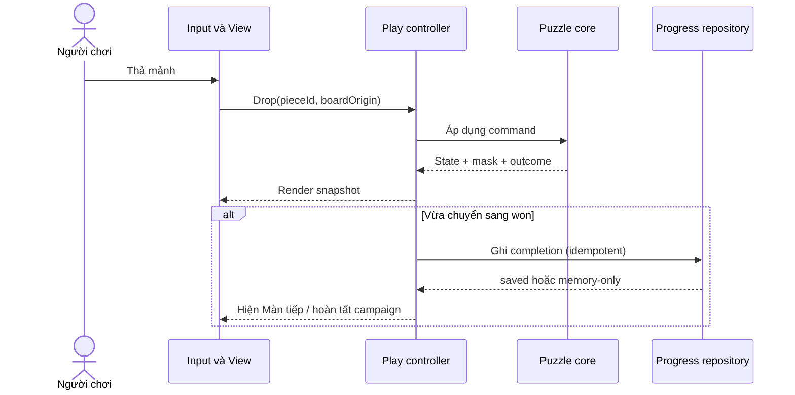

# 01 — Khởi tạo và kiến trúc

Nguồn: GDD §1, §4–5. Phụ thuộc: [phạm vi và quyết định nguồn](README.md). Trạng thái: quyết định kỹ thuật đã được người dùng duyệt cùng bộ spec ngày 2026-09-30.

## 1. Kết quả cần đạt

**FND-01:** Khởi tạo bản mới tại `game-next/`, chạy được một shell Phaser trên web và Android offline. Shell là mốc kỹ thuật; chưa tự nhận đã có gameplay hay campaign. Cấu trúc phải cho kiểm thử toàn bộ luật puzzle mà không khởi tạo Phaser hoặc WebView.

**FND-02:** Runtime mới không import từ `game/`. Có thể đọc prototype để hiểu hành vi, nhưng mọi phần tái sử dụng phải được đưa qua hợp đồng và kiểm thử của bản mới. Android debug application ID dự kiến `com.nkhanh.mirror.rebuild`, tách khỏi `com.nkhanh.mirrorprototype` để cài thử song song. Đây là ID phát triển; ID phát hành được quyết định khi chuẩn bị release.

## 2. Công cụ và phiên bản

**FND-03:** Giữ stack GDD: Phaser 3, TypeScript, Vite, Capacitor 8; Vitest cho logic/integration không cần thiết bị. Dùng dependency/lockfile trong prototype làm điểm đối chiếu khi chọn phiên bản, không suy ra các dải version trong `package.json` đều đã được chứng minh tương thích.

Khi khởi tạo, xác minh phiên bản thực tế từ lockfile và yêu cầu Node/JDK/Android của đúng phiên bản công cụ; ghi chúng vào `game-next/README.md`, khai báo `engines` và lưu lockfile riêng. Chỉ chọn bộ version khi `npm ci`, typecheck, test và web build cùng chạy thành công. Android phải build debug độc lập; không lấy web build thành công thay cho bằng chứng Android.

Các script công khai cần có: `dev`, `typecheck`, `test`, `build`, `content:validate`, `android:sync`. `content:validate` kiểm tra schema và nghiệm, không tự duyệt mỹ thuật. Release build phải fail khi campaign thiếu level đã duyệt; dev shell được dùng fixture kỹ thuật theo spec 04.

## 3. Ranh giới module

```text
game-next/
  src/
    domain/          ô, hình, mask, snap, session, campaign rules
    application/     điều phối command, phiên chơi, FTUE, port lưu/log
    infrastructure/  browser storage, Android lifecycle, đồng hồ và log
    presentation/    Phaser scenes, input adapter, board renderer, HUD
    content/         manifest, level được duyệt, loader
    main.ts          ghép dependency và khởi động
  tests/fixtures/    dữ liệu kỹ thuật, không đi vào campaign release
  public/           tài nguyên đóng gói offline
  android/          wrapper riêng, tạo khi làm M0
```

**FND-04:** Domain chỉ nhận dữ liệu và trả kết quả; không gọi Phaser, DOM, storage, thời gian hoặc ngẫu nhiên. Application điều phối domain và các port. Infrastructure triển khai port. Presentation gửi ý định của người chơi tới application và vẽ snapshot. `main.ts` là nơi ghép các phần; tránh import ngược hoặc singleton storage trong domain.

| Module | Nhận | Trả / tác động | Chủ sở hữu hợp đồng |
|---|---|---|---|
| Content loader/validator | Dữ liệu level không tin cậy | Level đã chuẩn hóa hoặc lỗi có vị trí | 04 |
| Puzzle session | Level, state, command | State mới, resultMask, delta vùng đổi, outcome | 02 |
| Play controller | Ý định input, lifecycle | Gọi session; thông báo view; ghi completion một lần | 03, 05 |
| Board renderer | Snapshot + mask + drag preview | Hình nhìn thấy; không quyết định thắng | 03 |
| Progress repository | Snapshot lưu phiên bản hóa | Kết quả load/save thành công hoặc lỗi có phân loại | 05 |
| Playtest recorder | Event đã chuẩn hóa | Log cục bộ có giới hạn | 06 |

## 4. Luồng dữ liệu



**FND-05:** Giao dịch domain hoàn thành trước khi bắt đầu hiệu ứng hoặc ghi storage. Animation không giữ quyền quyết định trạng thái. Save thất bại không đảo kết quả thắng. Mỗi lần render lại không được phát sinh completion hoặc save mới.

## 5. Các quyết định kiến trúc để review

| Quyết định | Lựa chọn | Lý do và hệ quả |
|---|---|---|
| ADR-01 — State | Command đồng bộ → snapshot/result; một controller sở hữu session | Dễ tái lập drag cancel, snap, win; không cần event bus toàn cục cho game nhỏ |
| ADR-02 — Save | JSON có schema/version qua repository cục bộ; namespace mới | Dữ liệu MVP là completion/settings. Không thêm mã hóa hoặc backend chưa có nhu cầu trong GDD; validate dữ liệu và xử lý lỗi theo spec 05 |
| ADR-03 — UI/core | Pure TypeScript cho luật, Phaser cho input/render | Có thể thay style mà không đổi kết quả puzzle; render và chấm dùng cùng mask |

Workflow Phase 3 cung cấp cấu trúc tham khảo. Các mục mẫu như ads/IAP, score/combo, match-3, mã hóa save và event bus bắt buộc không tự trở thành yêu cầu Mirror. Khi bộ spec được duyệt, có thể xuất ba quyết định trên thành ADR riêng nếu cần hồ sơ Phase 3; không tạo bản kiến trúc thứ hai có nội dung trùng lặp trong mốc này.

## 6. Lỗi và điều kiện nghiệm thu

- **FND-06:** Level lỗi được báo tên level và mã lỗi; không khởi tạo session nửa chừng. App có đường quay về menu hoặc trang lỗi dữ liệu ngắn trong build nội bộ.
- **FND-07:** Tài nguyên cần để mở màn được đóng gói local. Bản Android không trỏ `server.url` tới dev server. Lỗi font/asset phụ dùng fallback dễ đọc, không chặn core.
- **FND-08:** Dọn input listener và subscription khi rời scene; vào/ra cùng màn nhiều lần không nhân đôi handler.

Nghiệm thu M0: cài từ checkout mới bằng hướng dẫn; typecheck/test/build đạt; shell hiển thị ở browser; Android debug build cài và mở được offline; domain test chạy mà không import Phaser; tên app/ID và storage key tách prototype. Ghi phiên bản công cụ và máy thử trong evidence, không chỉ ghi “đã chạy”.
