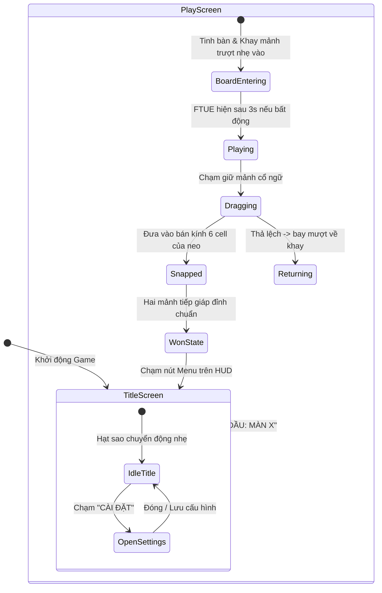

# Đặc tả Thiết kế UX/UI — Tái thiết Giao diện Thiên Hà & Đồ họa Vector (Galaxy Vector Redesign)

* **Ngày lập:** 01/10/2026  
* **Trạng thái:** Đề xuất thiết kế hoàn chỉnh (UX/UI Design Spec)  
* **Dựa trên:** Yêu cầu người dùng (01/10/2026) — Tinh chỉnh phong cách sang dịu galaxy huyền bí, đồ họa vector phẳng thẳng tắp không răng cưa, chuyển động nhẹ nhàng, tinh giản màn hình chính (Tiêu đề, Bắt đầu màn X, Cài đặt, ẩn map level) và chuẩn hóa responsive web container.  
* **Phạm vi áp dụng:** Không gian làm việc `game-next/` (Presentation Layer & CSS Web Shell), giữ nguyên 100% tầng Domain & Session Logic hiện có.

---

## 1. Cơ sở Thiết kế & Bằng chứng (Basis)

| Yếu tố | Chi tiết |
|---|---|
| **Nguồn gốc yêu cầu** | Phản hồi trực tiếp từ người dùng sau khi trải nghiệm Vertical Slice M1: Giao diện trên web chưa có cảm giác responsive tự nhiên; màn hình chính quá nhiều thẻ màn chơi (18 ô) gây rối mắt; hình thoi bị răng cưa dạng bậc thang (stair-step pixel aliasing) do render từng ô vuông con 4.5px. |
| **Mục tiêu trải nghiệm (UX Goal)** | Đưa người chơi vào một không gian chiêm tinh tĩnh lặng, huyền ảo (Cosmic Zen / Astrological Minimalist): nhẹ nhàng, dịu mắt, sắc sảo, không răng cưa; nhịp tương tác kéo thả mượt mà với hiệu ứng ánh sáng starlight breathing. |
| **Ràng buộc kiến trúc (Constraints)** | 1. **Zero Domain Impact:** Giữ nguyên vẹn toán học ma trận $128 \times 128$, các rule giao thoa chẵn lẻ (`evaluate`), `applyCommand`, `ProgressRepository`.<br>2. **Hiệu năng 60 FPS:** Các hiệu ứng chuyển động sao/hạt nền nhẹ được vẽ trực tiếp bằng Phaser Graphics/Particle nhẹ hoặc CSS thuần, không dùng asset ảnh nặng gây tăng dung lượng.<br>3. **Tính tương thích:** Chạy mượt mà cả trên Web Desktop (khung mô phỏng thanh lịch) lẫn Mobile Android Native (tràn viền 100%). |

---

## 2. Hệ Thống Design Tokens — Tinh Vân Chiêm Tinh (Galaxy Nebula Tokens)

```
                    [ 05 08 14 ] Deep Void (Nền không gian vô cực)
                           │
       ┌───────────────────┴───────────────────┐
       ▼                                       ▼
 [ 0A 11 28 ] Cosmic Navy (Tinh Bàn)     [ 11 1D 38 ] Astral Slate (Khay & Nút)
       │                                       │
       ▼                                       ▼
 [ 4E CD C4 ] Nebula Cyan (Bóng Mẫu)     [ F9 C7 4F ] Star Gold (Mảnh Cổ Ngữ)
       │                                       │
       └───────────────────┬───────────────────┘
                           ▼
             [ EE F4 FA ] Starlight White (Tâm điểm & Ánh sáng nối)
```

| Token ID | Giá trị Màu Hex / RGB | Ý nghĩa & Vị trí sử dụng |
|---|---|---|
| `color-bg-void` | `#050814` (`0x050814`) | Nền vũ trụ sâu thẳm, dịu mắt, độ tương phản cao với chi tiết sáng. |
| `color-board-surface` | `#0a1128` (`0x0a1128`) | Bề mặt Tinh Bàn (Board), bo góc $16\text{px}$, độ trong suốt $0.85$. |
| `color-tray-surface` | `#0d1730` (`0x0d1730`) | Khay chứa cổ ngữ bên dưới, có viền phát sáng nhẹ. |
| `color-star-gold` | `#f9c74f` (`0xf9c74f`) | Màu phát quang của mảnh cổ ngữ Amber: màu vàng sao dịu, không chói gắt. |
| `color-nebula-cyan` | `#4ecdc4` (`0x4ecdc4`) | Màu bóng mục tiêu (Silhouette) và đường nối chòm sao (Constellation trace). |
| `color-white-star` | `#eef4fa` (`0xeef4fa`) | Màu chữ chính, tâm điểm neo (Anchor dot), và tia sáng chiến thắng. |
| `color-aura-glow` | `#3a86ff` (`0x3a86ff`) | Hào quang tỏa sáng mềm mại (Ambient glow) khi mảnh chạm neo. |

---

## 3. Kiến Trúc Luồng Tương Tác (Interaction Architecture)



### Flow 1: Màn hình chính Tinh Giản (Title Screen — `MenuScene` Redesign)
* **Thành phần giao diện:**
  1. **Bầu trời sao trôi (Cosmic Starfield):** 40-50 điểm sao nhỏ li ti với độ sáng và chu kỳ nhấp nháy ngẫu nhiên nhẹ nhàng (gentle twinkle), không gây rối mắt.
  2. **Logo Chiêm Tinh:**
     * Chữ lớn: **`M I R R O R`** phát sáng ánh vàng sao dịu (Amber Starlight Glow), khoảng cách chữ rộng (`letter-spacing: 8px`).
     * Phụ đề: *Chiêm Tinh Cổ Ngữ · Bí Ẩn Giao Thoa* (Cosmic Cyan dịu nhẹ).
  3. **Nút Hành Động Chính (Primary Hero CTA Button):**
     * Tự động xác định màn chơi kế tiếp từ `ProgressRepository`:
       * Nếu chưa chơi 1-1: Hiển thị **`✦ BẮT ĐẦU: MÀN 1-1 (SONG TINH) ✦`**.
       * Nếu đã xong 1-1: Hiển thị **`✦ TIẾP TỤC: MÀN 1-2 ✦`** (hoặc nút *"Chơi lại Màn 1-1"*).
     * Thiết kế: Nút bo góc hình thoi/oval hiện đại, viền dạ quang thở nhẹ (subtle pulse animation), kích thước chạm chuẩn ngón tay ($320\text{px} \times 58\text{px}$).
  4. **Nút Cài Đặt (Secondary Settings Button):**
     * Nút thanh mảnh phía dưới: `⚙ CÀI ĐẶT`. Chạm vào mở hộp thoại modal ngay trên canvas.
  5. **Ẩn hoàn toàn Level Map 18 ô:** Loại bỏ danh sách 18 thẻ màn chơi làm chật chội màn hình.

### Flow 2: Modal Cài Đặt Dịu Nhẹ (Settings Modal Overlay)
* Xuất hiện với hiệu ứng mờ dần (fade-in) mềm mại:
  * **Bóng Mục Tiêu (Silhouette):** Toggle chuyển đổi `BẬT / TẮT` (lưu vào `settings.showTarget`).
  * **Âm Thanh (Sound Effects):** Toggle `BẬT / TẮT` (chuẩn bị sẵn cho M2).
  * **Đặt Lại Tiến Trình (Reset Progress):** Nút đỏ cam dịu, yêu cầu xác nhận 2 bước để bảo vệ người chơi.
  * **Nút Đóng (X / Quay lại):** Thu hồi modal về Title Screen.

### Flow 3: Bàn Cờ Đồ Họa Vector Phẳng Sắc Nét (`BoardRenderer` Redesign)
* **Giải quyết dứt điểm vấn đề răng cưa bậc thang:**
  * **Không dùng lệnh vẽ từng ô vuông `fillRect` $4.5\text{px}$** khi thể hiện hình dáng mảnh.
  * Thay vào đó, mảnh hình thoi được render bằng **Đồ họa Vector Polygon 4 đỉnh chuẩn**:
    $$P_1 = (x_{tâm}, y_{tâm} - r), \quad P_2 = (x_{tâm} + r, y_{tâm}), \quad P_3 = (x_{tâm}, y_{tâm} + r), \quad P_4 = (x_{tâm} - r, y_{tâm})$$
    với $r = 20 \times \text{cellPixel}$ (bán kính 20 cell $= 90\text{px}$ trên màn 720p).
  * Cạnh nối giữa 4 đỉnh là đường thẳng tắp vector được khử răng cưa mượt mà (Antialiased Line & Solid Fill).
  * **Mặt phẳng mảnh thoi:** Tô màu Gradient xuyên sáng nhẹ (Gradient Glass Amber), viền chỉ vàng tinh tế dày $1.5\text{px}$.
  * **Chuyển động nhẹ trong khay:** Các mảnh trong khay có biên độ bay bồng bềnh rất nhẹ ($\pm 2\text{px}$ theo nhịp sin $2\text{s}$) tạo cảm giác vật phẩm sống động như đá quý bay lơ lửng.
  * **Bóng mục tiêu (Silhouette):** Vẽ bằng 2 hình thoi vector phẳng màu lam nhạt (`Nebula Cyan` với alpha $0.15$), viền đứt nét chiêm tinh nhẹ nhàng.
  * **Tiếp giáp đỉnh hoàn hảo:** Hai thoi khi hút vào neo A sẽ chạm đúng 1 điểm đỉnh tại giữa $(64, 96)$, không đè ô, thẳng tắp và trong trẻo.

### Flow 4: Web Responsive Container (Khung Trải Nghiệm Vũ Trụ)
* **Trên Desktop / Màn hình ngang (Laptop, PC 16:9, 21:9):**
  * Trang web hiển thị toàn màn hình nền vũ trụ chuyển động sao li ti.
  * Canvas game đặt trong một **Khung Tinh Bản Di Động (Astrological Slate Frame)**:
    * Bo góc mềm mại ($24\text{px}$).
    * Đổ bóng dạ quang huyền bí (Glow box-shadow: `0 20px 60px rgba(78, 205, 196, 0.15)`).
    * Giới hạn tỷ lệ vàng $9:16$ (chiều cao tối đa 92vh), giữ sắc nét mọi độ phân giải.
* **Trên Mobile / Tablet:** Tự động co giãn vừa vặn 100% không gian hiển thị, hỗ trợ các vùng notch/tai thỏ an toàn.

---

## 4. Hợp Đồng Bàn Giao Thiết Kế (Handoff Contract)

| Thành phần | Đặc tả chi tiết cho Lập trình viên |
|---|---|
| **Mã nguồn tác động** | 1. `game-next/src/style.css` & `index.html`: Cấu trúc khung web responsive và nền ambient galaxy.<br>2. `game-next/src/presentation/MenuScene.ts`: Giao diện Title Screen tối giản, nút Bắt đầu, Settings modal.<br>3. `game-next/src/presentation/BoardRenderer.ts`: Vẽ polygon vector thẳng tắp cho hình thoi thay vì duyệt 16.384 pixel.<br>4. `game-next/src/presentation/PlayScene.ts`: Chuyển động nhẹ (floating shimmer) và hiệu ứng starlight khi snap. |
| **Logic & Tests** | Không sửa đổi bất kỳ logic nào trong `src/domain/` hay `src/application/`. Toàn bộ 56 tests hiện hành phải tiếp tục PASS 100%. |
| **Xác minh trực quan (Verification)** | 1. Cạnh hình thoi thẳng tắp $100\%$, không còn bất kỳ nốt răng cưa bậc thang nào.<br>2. Mở trên Desktop: Game nằm trong khung pha lê gọn gàng giữa màn hình, không bị co kéo kỳ dị.<br>3. Màn hình chính chỉ có: Tên game, Nút bắt đầu màn chơi, Nút cài đặt. Chạm là vào chơi ngay. |

---

## 5. Kế Hoạch Triển Khai

1. **Bước 1 — CSS Web Shell & Responsive Container:** Cải tổ `index.html` và `style.css` để tạo khung Star Frame sang trọng, ambient glow galaxy nền.
2. **Bước 2 — Vector Polygon Renderer:** Tái cấu trúc `BoardRenderer.ts` để vẽ hình thoi bằng vector polygon phẳng mượt mà, khử răng cưa và hiệu ứng phát sáng dịu.
3. **Bước 3 — Galaxy Title Screen & Settings:** Làm lại `MenuScene.ts` với logo sao, hạt sao trôi nhẹ, nút bắt đầu to rõ và modal cài đặt.
4. **Bước 4 — Kiểm thử & Kiểm chứng:** Chạy lại `npm test`, `npm run typecheck`, `npm run build` và xác nhận trên trình duyệt.
