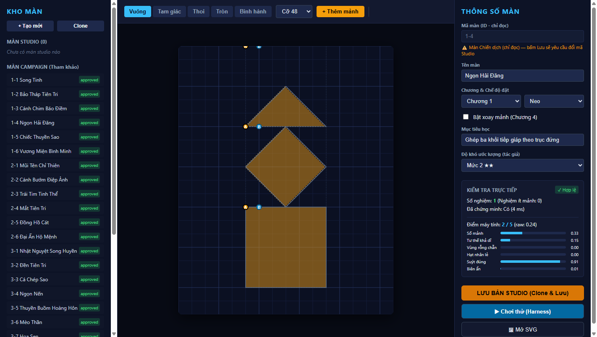
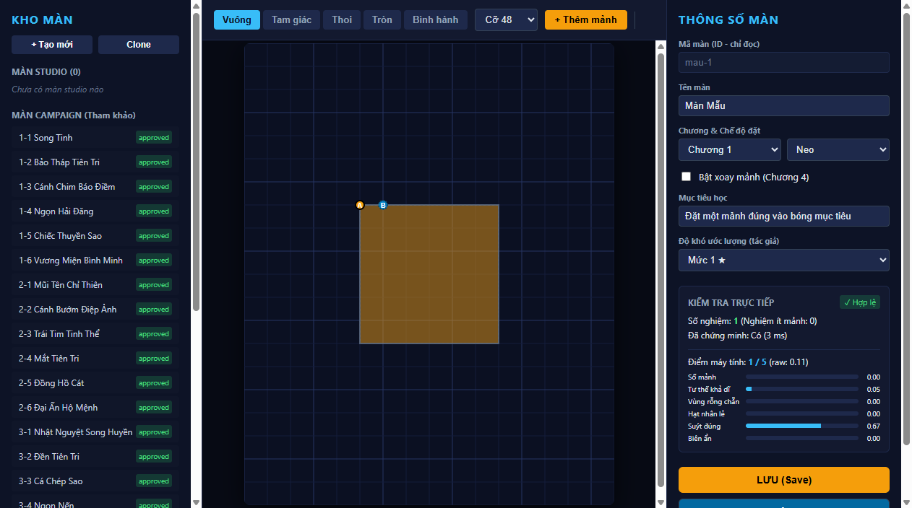

# Báo cáo nghiệm thu Xưởng tạo màn (Mirror Studio — Plan E)

- **Trạng thái:** `passed` (đã được người duyệt NKhanh0908 nghiệm thu)
- **Ngày tạo:** 2026-10-04
- **Nhánh:** `feat/level-studio-e3`
- **Ảnh nghiệm thu:**
  - 
  - 
  - 

---

## 1. Mục tiêu và tiêu chí nghiệm thu (Spec E §7)

Người review mở dev server (`npm run dev`) truy cập `http://localhost:5173/studio.html` và thực hiện trọn vẹn quy trình sau mà không cần sửa code:

1. **Clone màn:** Chọn màn `1-4` (hoặc `3-4`), bấm nút **Clone** để tạo một màn studio mới (ví dụ: `mau-1-4-copy`).
2. **Chỉnh sửa bàn chơi:** Thêm một mảnh từ thanh công cụ (Palette), thêm neo nhiễu cho mảnh.
3. **Kiểm tra trực tiếp (Live check):** Quan sát cột phải (Inspector) cập nhật số nghiệm, trạng thái giải, cảnh báo và điểm độ khó 1–5 cùng 6 thành phần tự động qua Web Worker.
4. **Lưu và chơi thử:** Bấm **LƯU (Save)** để ghi đủ 4 tệp studio (`.ts`, `.json`, `.svg`, `-report.md`). Nút **▶ Chơi thử (Harness)** kích hoạt, mở màn chơi trên harness và có thể giải thắng.
5. **Đưa vào chiến dịch (Promote):** Chạy lệnh `npm run content:promote -- <studio-id> <target-id>` (ví dụ đưa vào một mã `planned` như `4-1`).
6. **Kiểm tra chất lượng:** `npm test` và `npm run build` xanh hoàn toàn, thư mục `dist/` không chứa `studio.html`.

---

## 2. Kết quả kiểm tra kỹ thuật (Automated Verification)

| Hạng mục | Tiêu chí | Kết quả | Ghi chú |
|---|---|---|---|
| **Cấu trúc 3 cột** | Cột trái (Kho màn), Cột giữa (Palette + Bàn chơi 512x640), Cột phải (Thông số màn + Biểu đồ thanh độ khó) | **ĐẠT** | Xem ảnh `acceptance.png` (1440x900) |
| **Bàn chơi SVG** | Hiển thị lưới 8/24 ô, bóng chẵn/lẻ (lẻ vàng `#d4af37`, chẵn rỗng, 3+ nét đứt), neo A vàng và neo nhiễu xanh lam/đỏ | **ĐẠT** | Kéo thả trực quan, snap lưới, clamp mép |
| **Thanh công cụ (Palette)** | 5 loại hình học (Vuông, Tam giác, Thoi, Tròn, Bình hành), cỡ khung tự co dãn, nút xoay/lật/xoá | **ĐẠT** | Tích hợp phím tắt `R`, `Shift+R`, `Delete`, `Ctrl+D`, mũi tên |
| **Web Worker Solver** | Chạy bất đồng bộ qua `createCheckQueue`, debounce 300 ms, trả kết quả `AuthorResult` | **ĐẠT** | Không block UI chính khi giải |
| **Bảng điểm 6 thành phần** | Điểm 1–5 kèm thanh phần trăm: Số mảnh, Tư thế, Vùng rỗng chẵn, Hạt nhân lẻ, Suýt đúng, Biên ẩn | **ĐẠT** | Khớp công thức DF-01 |
| **API Dev Studio** | `GET /__studio/list`, `POST /__studio/save`, `POST /__studio/delete` kèm chống CSRF | **ĐẠT** | Test tích hợp ghi đủ 4 tệp và xoá sạch |
| **Đóng gói sản phẩm** | `npm run build` tạo web bundle | **ĐẠT** | `dist/index.html` sạch; `dist/studio.html` không tồn tại |
| **Bộ kiểm thử** | Vitest chạy toàn bộ | **ĐẠT** | 47 test suites, 605/605 tests pass |

---

## 3. Hướng dẫn dành cho Người duyệt (Reviewer Walkthrough)

1. Khởi động máy chủ phát triển:
   ```bash
   cd game-next
   npm run dev
   ```
2. Mở trình duyệt tại: `http://localhost:5173/studio.html`
3. Ở cột trái **Kho màn**, click chọn **1-4 Ngọn Hải Đăng**. Bấm **Clone**, nhập mã mới ví dụ `studio-review-1`.
4. Chọn một loại hình trong Palette (ví dụ Tam giác), bấm **+ Thêm mảnh**. Kéo mảnh vào vị trí trên bàn cờ. Bấm **+ Neo nhiễu** để thêm neo gạt.
5. Quan sát cột phải:
   - Thấy trạng thái kiểm tra (Số nghiệm, Đã chứng minh).
   - Thấy bảng điểm cập nhật.
6. Bấm nút **LƯU (Save)** màu vàng cam.
7. Bấm nút **▶ Chơi thử (Harness)** để kiểm tra trải nghiệm chơi thực tế trong game.
8. (Tuỳ chọn promote thử):
   ```bash
   npm run content:promote -- studio-review-1 4-1
   ```
   Kiểm tra git status xem `4-1` đã được tạo và manifest được cập nhật thành `approved`.
9. Khi hoàn thành nghiệm thu, chuyển dòng `Trạng thái: pending` ở đầu tài liệu này thành `passed`.
